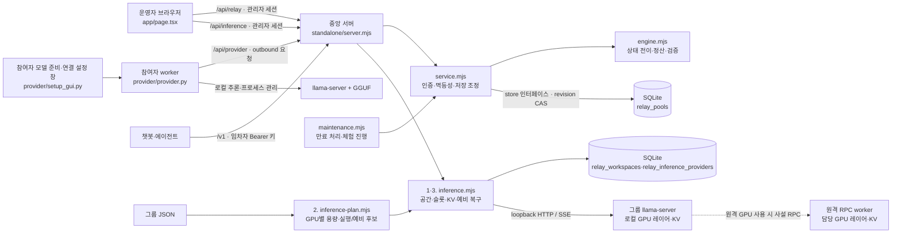

# 프로젝트 구조와 LLM 리팩토링 가이드

> 기준: 2026-09-30 현재 소스. 구조·실행 경로·계약을 바꾸면 이 문서도 갱신한다.
> 처음에는 이 문서와 변경 대상 파일만 읽는다. 전체 구성·상태·신뢰 경계는 [전체 구성 아키텍처](docs/architecture-review-ko.md), 설치·운영 세부 사항은 [README](README.md), 분야별 문서는 [문서 목차](docs/README.md)를 참조한다.

## 1. 한눈에 보는 프로젝트

**Relay**는 참여 GPU를 관리하는 단일 운영자용 파일럿이다. 문서별 독립 추론·인용 검증·CR 정산과, 한 GPU에 들어가지 않는 모델을 고정 GPU 그룹에 레이어 분할해 제공하는 분산 LLM 경로가 있다.

| 구분 | 현재 구현 |
|---|---|
| 웹 화면 | React 19 + TypeScript + Vite + Tailwind CSS 4, 공용 UI는 `components/ui/` |
| 중앙 서버 | Node.js HTTP + 내장 `node:sqlite`; Node.js 22.13 이상 |
| 참여자 | Python 3.10 이상; 문서 경로는 Tkinter + 전용 llama-server, 분산 경로는 별도 leader/RPC 실행기 |
| 문서 처리 | 문서별 작업 병렬 실행; 중앙 서버는 인용 검증·결정적 병합·CR 정산, SQLite에 저장 |
| 분산 LLM | 네 계층 실행 공간·실행 하나/선택 예비 독점·레이어별 가중치/KV·예비 포함 공간의 응답 재생성 |
| 실행 모드 | 문서 `demo/live` 계정·작업·원장은 분리; 분산 경로는 별도 구성·공간/제공 상태 SQLite·진행 요청 메모리 |
| 현재 범위 | 관리자 1명, 문서 풀 `local-owner`; 분산 임차자 API 키 지원, 신뢰된 제공자·고정 그룹, 자동 임대·과금 미구현 |

`app/page.tsx`라는 이름을 쓰지만 현재 실행 경로는 **Vite SPA**다. 사용하지 않던 D1 예제와 빈 DB 스캐폴딩은 제거했다. 실제 저장소는 `standalone/server.mjs`가 여는 SQLite다.



### 분산 LLM 경로

기존 문서 작업 경로와 별도로, 한 GGUF 모델의 가중치·KV를 로컬 또는 여러 GPU에 배치하는 관리형 추론 경로가 있다. `RELAY_INFERENCE_CONFIG`가 없으면 비활성이다. [Petals 비교 결정](docs/petals-architecture-decision-ko.md)에 따라 EC2·기존 실행기를 유지하고 단일 실행 그룹을 기본으로 한다. 네 책임은 실행 공간·자원 구성·모델 실행·GPU 제공과 회수이며 별도 서버를 만들지 않는다. 계약은 [네 계층 구현 문서](docs/distributed-workspace-design-ko.md), 명령은 [분산 운영 문서](docs/distributed-inference-ko.md)를 기준으로 한다.

| 소스 | 책임 |
|---|---|
| `lib/relay/inference-plan.mjs` | 2계층: GPU별 f16 KV·VRAM, 단일 실행·선택 예비 후보, 선택 비용·실측/추정 조건 검증 |
| `scripts/plan-two-gpu.mjs` | 고정 모델 텐서 크기로 두 GPU의 시작 전 레이어 배치 계산·새 설정 저장; 실행 중 이동 없음 |
| `lib/relay/inference.mjs` | 1·3계층: 공간 소유권·고정 주소·키·단일 요청, 가용 그룹 배정·세션 친화성, 독점·선택 예비 전환·토큰·KV·SSE·취소 |
| `provider/distributed_runtime.py` | 3·4계층: b10964 로컬 leader/선택 RPC·GGUF 계약·사설망, 로컬 중단 GUI·소유 프로세스 반환 확인·인증 상태 알림 |
| `app/inference-panel.tsx` | 실행/선택 예비 구성·비용/성능·공간 생성/종료·연결 설정 다운로드·복구 표시·관리자 대화 |
| `tests/inference-plan.test.mjs`, `tests/inference.test.mjs`, `tests/inference-http.test.mjs`, `tests/distributed_runtime_test.py` | 계획·동시성·HTTP(fake engine)·프로세스 계약 검증 |
| `tests/inference-workspaces.test.mjs`, `tests/workspace-http.test.mjs`, `tests/inference-browser.test.mjs` | 공간 예약·재생성·취소·키 범위·SQLite 복원·화면 회귀 |

`standalone/server.mjs`는 `/api/inference/workspaces`를 관리자 쿠키로, `/v1/workspaces`를 임차자 키로 목록·생성·종료한다. 고정 `/v1/workspaces/<id>/chat/completions`에는 소유 임차자 키 또는 생성 시 한 번 반환하는 공간 키를 사용한다. 공간 키는 조회·생성·종료 권한이 없다. 기존 일반 그룹 API도 유지한다. 공간 SSE 기본은 완료 후 전달, `restart_on_failure:true`는 `relay.restarting` 폐기와 `relay.completed` 확정을 처리하는 클라이언트용이다. provider 키·관리자 키·공간 키의 범위를 섞지 않는다.

SQLite `relay_workspaces`에 공간·선택 fingerprint·키 해시를, `relay_inference_providers`에 GPU별 제공 세대·상태·승인 키 해시를 저장한다. 재시작 때 공간 소유권·선택 계약을 재검사하고 엔진 idle/KV 초기화부터 한다. 대화·KV·진행 요청·재시도 영수증은 영속 저장하지 않는다. 비용은 선택한 그룹만 합산하며 분산 임대 자동 정산은 없다. 단일 후보는 `id=group.id`, `standbyGroupId:null`, `groupIds:[id]`, 예비 포함은 기존 `primary~standby`다. GPU는 다른 그룹·일반 worker·다른 Relay 프로세스에 중복 제공하지 않는다.

변경 시 템플릿·문맥·슬롯 계약과 `input+max_output` 검사, 임차자 namespace, erase ACK 전 슬롯 재배정 금지, 실패한 세대의 출력 거부를 유지한다. 실제 GPU 배치/메모리는 runtime 로그와 부하 측정으로 검증해야 하며 설정 계산을 실측으로 표시하지 않는다.

## 2. 소스 지도

주요 파일만 표시한 구조다.

```text
gpu_togeter/
├─ PROJECT_MAP.md                # 이 문서: 코드 탐색·변경 영향 지도
├─ README.md                     # 설치·운영·검증 기록
├─ START-RELAY.cmd               # Windows 중앙 서버 실행
├─ START-PROVIDER.cmd            # Windows 참여자 설정 창 실행
├─ OPEN-AWS-RELAY.cmd            # 배포된 AWS 사이트 열기
├─ app/
│  ├─ page.tsx                   # 로그인, 조회, 작업·모델·노드·원장·내보내기
│  ├─ service-home.tsx           # 공개 서비스 진입
│  ├─ participant-panel.tsx      # 개인 계정·GPU 제공·대여·CR
│  ├─ setup-guide.tsx            # 체험/실제 GPU 연결 안내 화면
│  ├─ inference-panel.tsx        # 실행 공간·실행/예비 후보·복구·관리자 대화
│  └─ globals.css                # 테마·레이아웃·반응형·접근성 스타일
├─ standalone/
│  ├─ index.html → entry.tsx     # React 화면 진입점
│  ├─ vite.config.ts             # 개발 프록시·별칭·빌드 출력 설정
│  ├─ server.mjs                 # HTTP 라우팅·인증·SQLite·정적 파일 제공
│  ├─ maintenance.mjs            # 독립적인 서버 유지보수 루프
│  ├─ provider-poll.mjs          # 유휴 제공자 대기·변경 알림·유휴 조회 직렬화
│  ├─ launch-auth.mjs            # 로컬 일회용 로그인·주소 검증
│  └─ provider-archive.mjs       # 참여자 배포 ZIP 생성
├─ lib/
│  ├─ relay/engine.mjs           # 상태 전이·배정·예약·정산·인용 검증
│  ├─ relay/service.mjs          # 명령 처리·멱등성·CAS·저장 크기 제한
│  ├─ relay/setup.mjs            # 웹의 모델 계약·연결 JSON·설정 진행 판정
│  ├─ relay/inference-plan.mjs   # GPU별 VRAM/KV·실행/예비 후보·비용/성능
│  ├─ relay/inference.mjs        # 공간·권한·슬롯·예비 복구·스트리밍·취소
│  └─ utils.ts                   # 공용 스타일 유틸리티
├─ provider/
│  ├─ provider.py                # 서버 통신·lease 갱신·추론·프로세스 종료
│  ├─ distributed_runtime.py    # leader/RPC·GGUF·로컬 중단 GUI·반환 알림
│  ├─ setup_gui.py               # 모델 준비/연결 설정의 두 단계 창·검증·worker 실행/종료
│  ├─ model_discovery.py         # 로컬·WSL 모델 위치의 제한된 탐색
│  ├─ gguf_metadata.py           # GGUF 메타데이터·내장 채팅 템플릿 읽기
│  └─ connection_discovery.py    # 다운로드 폴더·이전에 선택한 연결 JSON 탐색
├─ public/                       # 제공자 Python·GGUF 메타데이터 정적 배포 사본
├─ deploy/aws/                   # EC2 Compose·Caddy HTTPS·영속 볼륨·백업
├─ scripts/
│  ├─ package-server.mjs         # 빌드된 화면·서버·AWS 설정만 묶고 상태·키 제외
│  ├─ launch.mjs                 # 필요 시 설치·빌드, 서버·브라우저 실행
│  ├─ dev.mjs                    # 중앙 서버와 Vite 동시 실행·종료
│  └─ install-ci.mjs             # npm ci 래퍼
├─ components/ui/ · hooks/       # 사용 중인 공용 UI와 화면 유틸리티
├─ kernels/                      # CUDA·TileLang 실험 커널과 실행 안내
├─ tests/                        # Node 테스트와 Python unittest
├─ docs/
│  ├─ README.md                  # 문서 목차
│  ├─ architecture-review-ko.md  # 전체 구성도·두 요청 흐름·상태·신뢰 경계
│  ├─ distributed-inference-ko.md # 분산 실행 명령·운영 계약·trade-off
│  ├─ distributed-workspace-design-ko.md # 네 계층·공간 API·복구·제공자 회수
│  ├─ kv-cache-scheduling-research-ko.md # KV·스케줄링 선행연구와 결정 근거
│  ├─ handoffs/                  # 다른 PC·Codex에 전달할 지침
│  ├─ reports/                   # 과거 검증·성능 측정·수정 기록
│  ├─ examples/                  # 그룹·모델·템플릿 설정 예제
│  ├─ research/                  # 연구 계산·원시 측정 JSON
│  └─ analysis/                  # 특정 시점 코드 분석·당시 소스 묶음
└─ vendor/                       # 포함된 CSS와 라이선스
```

소스 외의 로컬 폴더는 다음과 같이 구분한다. 현재 웹 빌드 산출물은 `standalone-dist/`이며, 오래된 `dist/`, `.next/`, `.vinext/` 산출물은 제거했다.

| 경로 | 역할과 보존 기준 |
|---|---|
| `node_modules/`, `standalone-dist/` | 설치한 의존성과 현재 웹 빌드. 필요하면 설치·빌드 명령으로 재생성한다. |
| `work/` | Git 제외 작업 폴더. 테스트 임시 데이터와 연구 환경·증거가 함께 있으므로 전체를 지우지 않는다. |
| `outputs/` | Git 제외 배포 ZIP·전달 자료·작성 문서. 고유 문서와 보관 자료를 유지한다. |
| `.relay/` | 실제 DB·관리자 키·모델·런타임. LLM 문맥이나 배포 파일에 포함하지 않는다. |
| `.wrangler/` | 이전 D1 로컬 상태. 현재 실행 경로와 별개이며 상태 보존을 위해 남긴다. |
| `.sites-runtime/`, `.agentworkforce/` | 개발 도구 설정과 작업 공간 식별 정보. 애플리케이션 소스가 아니며 공유하지 않는다. |

## 3. 핵심 실행 흐름과 경계

### 시작과 화면

- Windows: `START-RELAY.cmd` → `scripts/launch.mjs` → 필요 시 설치·빌드 → `standalone/server.mjs` → 브라우저. 기존 빌드가 있으면 재빌드하지 않으므로 화면 수정 후에는 `npm run build`가 필요하다.
- 개발: `npm run dev` → `scripts/dev.mjs` → 중앙 서버 `8788` + Vite `5173`; Vite의 `/api`·`/v1` 프록시가 중앙 서버로 전달한다.
- 배포 실행: `npm run build` → `standalone-dist/`; `npm start` → Node 서버가 화면과 API를 함께 제공한다.
- 작업·모델·PC 등록 폼은 결과 응답이 유실되면 같은 내용과 requestId를 메모리에 유지해 재전송한다. PC 등록은 노드 키도 유지한다. 새 작업 열기·내용 변경·로그아웃은 별도 제출로 구분하며 페이지 새로고침을 넘는 복구는 보장하지 않는다.
- 문서 화면은 보이는 동안 약 2.2초, 분산 그룹 화면은 약 5초마다 상태를 조회한다. 만료 처리·체험 진행은 서버 타이머가 담당한다. `page.tsx`의 세션/조회 순서 검사와 `AbortController`는 늦은 응답이 새 상태나 로그아웃을 덮어쓰는 것을 막는다.

### 문서별 독립 GPU 작업

1. 설정 창에서 실행파일·GGUF·템플릿을 선택하고 모델 계약 JSON을 만든다. 웹에서 모델 승인 → 노드 등록 → 연결 JSON 발급을 진행한다.
2. `setup_gui.py`가 연결 JSON과 선택한 파일을 검사하고 별도 worker를 시작한다. worker의 `Provider`가 전용 `llama-server`를 소유한다.
3. 운영자가 문서·필드·모델·예산·기한을 제출한다. 서버가 task를 만들고 크레딧을 예약한다.
4. 참여자가 작업을 요청하면 서버가 모델·문맥·VRAM·허용 노드를 확인해 lease를 부여한다. 참여자는 추론 중 같은 실행 시도의 lease를 갱신한다.
5. 결과 제출 시 서버가 실행 권한과 계약을 검사하고 결과·정산·예약 해제를 같은 저장 갱신으로 확정한다. 원문 인용을 검사해 최종 결과를 구성한다.
6. 연결 단절·회수·기한 초과 시 서버가 재배정 또는 종료를 결정한다. 참여자는 소유한 추론 프로세스를 정리한다.

새 제공자는 유휴 `poll`에만 `waitMs:10000`을 보내고 서버 변경 알림 또는 기한까지 기다린다. 서버는 매번 SQLite/CAS로 인증·배정을 다시 확인하며, 실제 저장이 성공한 live 변경만 대기자를 깨운다. 서버의 `store.runCommand`는 짧은 로컬 상태 변경을 직렬화해 동시 조회와 작업 등록의 반복 충돌을 줄인다. 다른 프로세스와의 CAS 검증은 유지하며 10초 대기·추론·다운로드는 이 순서 밖에서 진행한다. 한 프로세스에서 최대 20개·노드당 1개 대기를 허용한다. 이 알림은 프로세스 내부 기능이므로 다른 프로세스의 변경은 최대 10초 뒤 재조회로 반영된다. 기존 제공자와 서버는 기존 polling으로 호환된다.

Python 제어 통신은 스레드별 최대 두 origin의 HTTP 연결을 재사용하고 JSON을 압축된 UTF-8 표기로 전송한다. POST 자동 재전송은 하지 않으며 응답 크기·URL·인증 검사를 유지한다. worker·설정 창·분산 실행기의 해당 스레드가 끝날 때 연결도 닫는다. 실행 완료는 future 완료 신호로 즉시 처리하고 실행 중 heartbeat 간격은 유지한다.

### 개인 GPU 지속 대여와 LLM 터미널

1. 회원이 상대 GPU와 업로드한 GGUF를 선택해 `rent`를 보내면 `engine.mjs`가 GPU를 독점 예약한다. `model-artifacts.mjs`는 이 활성 예약에 한해 제공자의 모델 다운로드를 허용한다.
2. 제공자 0.5.0 이상이 `rental-session`을 광고하고 `poll`의 대여 정보를 받아 모델을 한 번 적재한다. 준비 중에도 lease를 갱신하고 `ready`를 보고한다. 대여 종료·제공 중지·연결 만료 시 프로세스와 임시 모델을 회수한다.
3. 웹은 대여 성공 즉시 LLM 터미널을 열며, 준비가 끝나면 같은 모델에 여러 프롬프트를 보낸다. 대화 기록은 완료된 턴만 문맥으로 재사용하고 `reset-chat`으로 새 대화를 시작한다.
4. 각 턴은 문맥 크기에 따른 최대 CR을 예약하고, 제공자가 보고한 새 입력·출력 토큰 합계 1,000개당 1 CR을 올림해 정산한다. 보고된 캐시 재사용 입력은 제외한다. 성공한 턴만 차감하며 `cancel`은 대여와 예약을 끝낸다. `archive`는 메시지와 답변을 삭제하고 거래 기록을 남긴다. 원격 제공자 사용량은 신뢰 기반이다.

성공한 대여 턴은 전체 대화를 job의 `messages`에 유지하고 과거 task에는 그 턴의 사용자 메시지만 남긴다. 진행·실패·재시도 중인 task의 전체 입력은 유지하며, 기존 저장 데이터의 과거 task를 일괄 변환하지 않는다. 예약 합계와 정산 원장 검증은 한 번의 인덱스 구성으로 반복 전체 탐색을 줄인다.

### 분산 LLM 요청

1. 운영자가 공통 그룹 JSON과 로컬 파일을 준비하고 leader를 실행한다. 한 호스트에서는 `--rpc`·`--trusted-private-network`를 생략하며 원격 GPU가 있을 때만 RPC worker와 사설 연결을 준비한다. Node planner는 GPU별 용량·중복을, Python launcher는 파일·GGUF·실행 엔진 계약을 검사한다.
2. Relay는 단일 실행 그룹과 선택적 예비 후보의 비용/성능 선언을 제시한다. 공간 생성 시 선택한 그룹만 독점 예약하고 준비를 확인한다. 공간당 활성 요청은 하나이며 후속 요청은 409, 사용자/슬롯 상한은 429다. 일반 요청은 같은 모델의 미예약·제공 가능·빈 슬롯 그룹 중 5분 이내 세션 KV, `ready → unchecked → unavailable`, 빈/만료 캐시 슬롯 존재, 낮은 슬롯 점유율 순으로 고른다. 동률이면 최근 배정이 오래된 그룹을 먼저 선택한다. 정리 중인 unavailable 그룹에 활성 슬롯이 있으면 제외한다.
3. 엔진 계약과 필요 시 idle/캐시 초기화를 확인한다. 동일 그룹의 동시 준비 검사는 공유하며 오래된 epoch의 실패로 새 실행을 무효화하지 않는다. 전체 messages의 정확한 입력 토큰과 출력 예약을 검사한 다음 요청별 KV 삭제를 시작한다. 입력 검사 실패·문맥 초과·토큰 검사 중 취소는 이전 KV와 캐시 시각을 보존한다.
4. 소유자는 tenant 접두사와 model/workspace/session JSON으로 구분한다. 슬롯은 같은 세션, 빈/만료 캐시, LRU 순이며 다른 소유자에게 넘길 때 KV 삭제 응답을 확인한다. 세션 ID 없는 완료 요청은 cacheOwner를 남기지 않는다. 레이어별 KV는 해당 GPU에 유지되며 Relay는 tensor를 병합하지 않는다.
5. 예비 포함 공간의 실패는 선택한 예비로 한 번 전환해 전체 기록을 재생성하고 이후 degraded로 남는다. 예비 없는 공간은 자동 우회하지 않는다. 일반 요청도 같은 요청을 다른 그룹에 자동 재전송하지 않으며 다음 요청에서 갱신된 상태를 반영한다. 재시작 알림을 지원하지 않는 SSE는 완료 시도만 전달한다. JSON도 내부 SSE로 첫 출력을 관찰해 복구 제한과 전체 생성 시간을 구분한다.
6. 제공자 GUI·Ctrl+C는 로컬 소유 프로세스를 먼저 회수한다. 상태 API의 runtimeId·startedAt으로 늦은 알림을 거절하며 실패 세대 출력은 epoch로 차단한다. 공간 종료는 요청/KV 정리 뒤 예약 해제이며 제공자 프로세스 종료와 별개다.

전체 대화 기록은 클라이언트가 매 요청에 전달한다. 세션 ID는 영속 대화 조회 키가 아니며, 5분 친화성은 주기적 KV 삭제 TTL이 아니다. 상세 순서와 장애별 동작은 [전체 구성 아키텍처](docs/architecture-review-ko.md)를 참조한다.

SSE는 전달된 출력 문자열을 검증기 안에 다시 누적하지 않는다. 일반 LF 행은 기본 문자열 검색을 쓰며 여러 data 행이 있는 이벤트만 배열을 만든다. `restart_on_failure:true` 경로는 출력 조각 1개 기준 큐로 소비 속도를 따르고 상류의 조각 선읽기는 유지한다. 빈 조각도 큐에서 세며, 조각 크기와 하위 버퍼가 별도이므로 전체 바이트 상한은 아니다. 기본 공간 SSE는 실패 시도의 부분 출력이 노출되지 않도록 기존 4MiB 제한 안에서 성공 시도를 모은다. 취소 완료는 공유된 erase ACK 대기를 통과한 뒤 확정한다. 추론 요청은 본문 수신 후 gateway 생성 제한시간에 10초 정리 여유를 더한 소켓 기한을 적용한다.

정적 파일은 파일 전체 복사 대신 길이가 제한된 스트림으로 전달하고 ETag를 지원한다. 해시가 붙은 자산만 장기 캐시하며, Caddy 압축도 `/assets/*`에 한정한다. Node는 인증된 상태 GET만 Brotli/gzip으로 협상하고 모든 응답의 Web 스트림을 native pipeline으로 직접 소비한다. 모델 업로드는 fsync를 유지한 write stream, 다운로드는 수요에 따른 256KiB 읽기와 주기적 권한 재검사를 사용한다.

service는 독립 JSON 해석 결과를 저장 확정 뒤 응답으로 소비해 snapshot 복사를 줄인다. 직접 engine 호출의 기본 snapshot은 독립 복사다. 유지보수는 최대 64개의 revision·다음 만료 시각만 기억하고 버전 변경·lease 기한·유휴 대여의 45초 연결 기한에 다시 검사한다. 제공자는 인증 후 최초 lease 전에 실행기 기능을 한 번 확인해 지원될 때만 CPU의 과거 프롬프트 snapshot을 끈다. 기존 GPU 슬롯의 KV 재사용은 유지한다. 상세 수치·교환 조건·운영 CUDA 연결 한계는 [1차 기록](docs/reports/performance-refactor-2026-09-29-ko.md)과 [2차 기록](docs/reports/performance-refactor-round2-2026-09-29-ko.md)에 정리한다.

### 서버 모듈의 책임

| 모듈 | 핵심 진입점과 책임 |
|---|---|
| [server.mjs](standalone/server.mjs) | HTTP·쿠키 세션·출처/빈도/크기 검사, SQLite store 구현, 정적 파일·설정 ZIP 제공 |
| [service.mjs](lib/relay/service.mjs) | `execute`, `getView`: 제공자 인증, 관리자 `requestId` 멱등성, 상태 로드, 전이·불변식 검사, CAS 최대 10회 재시도 |
| [engine.mjs](lib/relay/engine.mjs) | `initialState`, `transition`, `sweep`, `assertInvariants`, `view`: 저장소 I/O와 분리된 상태 변경. 내부 UUID 생성이 있으므로 완전히 순수한 결정적 함수로 가정하지 않는다 |
| [maintenance.mjs](standalone/maintenance.mjs) | `createMaintenanceScheduler`: 기본 1초마다 필요한 풀만 같은 서비스 경로로 처리, 중첩 실행 조정, 종료 시 진행 중 처리 대기 |

### API와 저장 계약

| 경로 | 용도 |
|---|---|
| `POST /api/login`, `POST /api/logout` | 관리자 키 로그인·세션 종료 |
| `POST /api/launch-login` | 기본 로컬 실행의 2분 유효·1회용 로그인 값 교환 |
| `GET /api/relay`, `POST /api/relay` | 관리자 상태 조회·명령. 명령은 `{ mode, action, payload, requestId }` |
| `POST /api/provider` | 노드 Bearer 키, `poolId`, `nodeId`, `action`, `payload`로 통신. `status`, `poll`, `submit`, `release` 사용 |
| `GET /api/setup`, `GET /api/setup/provider.zip` | 인증된 설정 정보·참여자 프로그램 다운로드 |
| `GET /api/inference`, `POST /api/inference/chat` | 관리자 쿠키로 분산 그룹 조회·대화 |
| `GET /v1/models`, `POST /v1/chat/completions` | 임차자 Bearer 키로 허용 모델 조회·미예약 그룹 추론 |
| `GET/POST /api/inference/workspaces`, `DELETE /api/inference/workspaces/<id>`, `POST /api/inference/workspaces/<id>/chat` | 관리자 쿠키로 자기 공간 생성·조회·종료·추론 |
| `GET/POST /v1/workspaces`, `DELETE /v1/workspaces/<id>` | 임차자 키로 자기 공간 조회·생성·종료 |
| `POST /v1/workspaces/<id>/chat/completions` | 소유 임차자 키 또는 공간 키로 고정 주소 추론 |
| `POST /api/inference/provider` | GPU별 제공 키·runtimeId·startedAt으로 제공/회수/반환 상태 알림 |

lease 갱신도 `poll` 액션을 사용하며 `attemptId`와 `epoch`를 전달한다. **갱신 요청과 신규 배정 요청을 구분하는 payload 계약**을 유지해야 한다.

- 문서 SQLite: 기본 `.relay/relay.sqlite`, WAL 모드. `relay_pools(id, revision, state)` 한 행에 풀 전체 JSON을 저장한다. 현재 풀 ID는 `local-owner`다.
- 상태: `version`, `books.demo`, `books.live`, `receipts`. 각 book에 `accounts`, `issued`, `jobs`, `nodes`, `models`, `ledger`, `events`가 있다.
- 작업 계층: job → documents / tasks → attempts / 현재 lease. document의 `taskId`는 품질 재시도 시 새 논리 task를 가리킬 수 있다.
- 설정 교환: 개인 GPU의 기본 경로는 `standalone/participation.mjs`의 10분 일회용 코드로 PC 도우미가 검사 결과를 직접 등록한다. 기존 `lib/relay/setup.mjs` 연결 JSON도 호환용으로 유지하며, 모델·런타임·템플릿 해시와 문맥 길이, 버전 1 및 선택적 `nodeName` 호환성을 확인한다.
- 분산 경로: `RELAY_INFERENCE_CONFIG` 그룹·가격·성능 선언·임차자·제공 키를 시작 시 검증한다. 공간과 제공 세대만 별도 SQLite 테이블에 저장한다. 슬롯·epoch·사용량·재시도 영수증은 메모리, KV는 엔진이며 영속 재시도 보장·임대 정산은 없다.
- 저장 경로는 `RELAY_DATA_DIR`, 서버 주소는 `RELAY_HOST`·`RELAY_PORT`, 원격 운영은 `RELAY_PUBLIC_ORIGIN`·`RELAY_SECURE_COOKIE`로 구성한다. 전체 환경변수는 [README](README.md)를 참조한다.

## 4. 변경하려는 기능별로 읽을 파일

| 변경 대상 | 먼저 읽을 소스 | 함께 확인할 검증 |
|---|---|---|
| 화면 분리·상태 관리·내보내기 | `app/page.tsx`, `app/setup-guide.tsx`, `app/globals.css`, 사용 중인 `components/ui/` | 타입·린트·빌드, 로그인/모드 전환/지연 응답/내보내기 수동 확인 |
| 스케줄링·예산·정산·인용 검증 | `lib/relay/engine.mjs`, `lib/relay/service.mjs` | `tests/engine.test.mjs`, `tests/maintenance.test.mjs`, `tests/http.test.mjs` |
| HTTP·인증·저장소 분리 | `standalone/server.mjs`, `standalone/launch-auth.mjs`, `lib/relay/service.mjs` | `tests/http.test.mjs`, `tests/launcher.test.mjs`, CAS·재시작 검사 |
| 만료·복구·서버 종료 | `standalone/maintenance.mjs`, `lib/relay/engine.mjs`, `scripts/dev.mjs` | `tests/maintenance.test.mjs`, `tests/launcher.test.mjs` |
| 추론·lease 갱신·프로세스 회수 | `provider/provider.py`, `provider/setup_gui.py`, `lib/relay/engine.mjs` | `tests/provider_test.py`, `tests/provider_setup_test.py`, HTTP 통합 검사 |
| 모델/연결 파일·설정 UX | `lib/relay/setup.mjs`, `provider/setup_gui.py`, `app/page.tsx`, `app/setup-guide.tsx` | `tests/setup.test.mjs`, `tests/provider_setup_test.py`, `tests/connection_gui_test.py` |
| 개인 GPU 연결 코드 | `standalone/participation.mjs`, `app/participant-panel.tsx`, `provider/setup_gui.py` | `tests/participation.test.mjs`, `tests/provider_setup_test.py`, `tests/gpu-connect-browser.test.mjs` |
| 모델·템플릿·연결 파일 탐색 | `provider/model_discovery.py`, `provider/gguf_metadata.py`, `provider/connection_discovery.py` | `tests/model_discovery_test.py`, `tests/gguf_metadata_test.py`, `tests/connection_discovery_test.py`, GUI 검사 |
| 분산 배치·GPU별 용량 | `lib/relay/inference-plan.mjs`, `provider/distributed_runtime.py`, `provider/gguf_metadata.py` | `tests/inference-plan.test.mjs`, `tests/distributed_runtime_test.py`, `tests/gguf_metadata_test.py` |
| 임차자·슬롯·KV·SSE·취소 | `lib/relay/inference.mjs`, `standalone/server.mjs`, `app/inference-panel.tsx` | `tests/inference.test.mjs`, `tests/inference-http.test.mjs`, `tests/inference-workspaces.test.mjs`, `tests/workspace-http.test.mjs`, `tests/inference-browser.test.mjs` |
| 실행기·배포 ZIP | `scripts/launch.mjs`, `START-*.cmd`, `standalone/provider-archive.mjs`, `standalone/vite.config.ts` | `tests/launcher.test.mjs`, 빌드 후 다운로드 ZIP 내용 확인 |

`provider/provider.py`와 `public/provider.py`는 현재 같은 내용의 별도 파일이며 자동 동기화 코드가 없다. 제공자 변경 시 두 파일을 함께 확인·동기화한다. **설정 ZIP은 `provider/`의 6개 Python 파일(분산 실행기 포함)과 `START-PROVIDER.cmd`를 직접 묶는다.** 새 모듈을 추가하면 ZIP 목록과 `launcher.test.mjs`도 갱신한다.

## 5. 리팩토링할 때 유지할 규칙

아래 1~8은 기존 문서 작업·참여자 설정 경로의 규칙이고, 9~12는 분산 LLM 경로의 규칙이다.

1. **상태·정산의 원자성:** 결과 수락·크레딧 지급·예약 해제를 같은 revision CAS로 확정한다. `assertInvariants`와 중복 요청/결과 처리를 보존한다. 관계형 저장소로 옮기더라도 이 경계는 유지한다.
2. **실행 권한:** 노드·`attemptId`·`epoch`·서버 시각을 함께 검사한다. 노드당 활성 lease 1개, lease 30초, 시도 hard stop 180초다. 만료된 실행의 결과나 갱신으로 새 작업 권한을 얻을 수 없어야 한다.
3. **정산과 품질의 분리:** 완료 실행은 문서당 10 CR(제공자 9, 운영자 1). usage로 과금하지 않는다. 인용 품질 실패 후 재호출은 새 task·새 예약이며 원래 예산 제한을 지킨다.
4. **재현 가능한 근거:** 원문 스냅샷·해시·정확한 인용과 UTF-16 위치를 유지한다. 보관 후에도 결과 해시·영수증을 남겨 중복 정산을 막는다. 화면 내보내기의 CSV 수식 방지도 유지한다.
5. **모드와 계약:** demo/live 상태·원장을 섞지 않는다. 승인한 모델·실행파일·템플릿·문맥 계약을 확인하고 입력을 임의로 잘라 추론하거나 다른 모델로 바꾸지 않는다.
6. **프로세스와 비밀키:** 참여자는 자신이 시작한 프로세스만 회수한다. 원격은 HTTPS, loopback만 HTTP 허용, redirect 거절을 유지한다. 노드 키는 서버에 해시로 저장하며 추론 프로세스·로그·경로용 환경설정에 전달하지 않는다. 연결 JSON으로 로컬 실행파일 경로를 설정하지 않는다.
7. **설정의 사용자 선택:** 탐색·파일 선택만으로 GPU 실행을 시작하지 않는다. 기존/실행 중인 연결을 새 다운로드가 자동 교체하지 않게 하고, 느린 파일 읽기·탐색 결과가 최신 선택을 덮어쓰지 않게 한다.
8. **상한과 저장 여유:** 노드 20, 모델 8, 미보관 작업 24, 작업당 문서 4·필드 6·누적 task 16, 문서 4,000 UTF-16 문자. 서비스는 풀 상태 1,700,000바이트 한도에 진행 중 task별 64,000바이트 결과 여유를 계산한다. 제한 변경 시 UI·코어·저장 검증을 함께 본다.

9. **분산 메모리·실행 계약:** GPU마다 가중치·workspace·reserve·최대 슬롯 KV가 들어가야 한다. 동일 GPU의 독점은 구성 선언이며 OS 잠금이 아니다. 지원 GGUF·모델/템플릿 해시·슬롯/문맥 계약과 정확한 토큰 검사를 유지한다.
10. **분산 KV 격리·취소:** 인증 tenant와 세션을 함께 식별한다. erase ACK 전 슬롯 재배정 금지, 취소 중 예약 유지, 오래된 epoch 출력 거부를 보존한다. 일반 요청 오류는 다른 사용자를 중단하지 않으며, 계약/정리 실패는 그룹 전체를 격리한다.
11. **공간 교체·완료 계약:** 선택한 그룹의 모델·템플릿 해시·양자화·엔진·문맥을 고정하고 비용을 합산한다. 공간당 활성 요청 하나, 예비가 있을 때만 자동 재생성 한 번, 이전 부분 응답 폐기를 유지한다. 도구는 확정 완료 뒤에만 실행하며 첫 출력 복구 시간과 전체 생성 시간을 구분한다.
12. **분산 신뢰·복구:** RPC는 승인한 사설 LAN/인증 overlay와 peer 방화벽 안에서만 운영한다. 관리자·제공자·임차자 키는 분리하고 upstream에 전달하지 않는다. 재시작 후 메모리 슬롯·KV를 신뢰하지 않으며, 추론 카운터를 과금 원장으로 취급하지 않는다.

## 6. 실행·검증 명령

프로젝트 루트에서 실행한다. 아래는 재현 명령이며 이 문서 작성 시 새로 실행한 결과를 뜻하지 않는다.

```sh
npm ci
npm run dev

# 변경 후 검증
npm test
python -m unittest discover -s tests -p "*_test.py" -v
npm run check
npm run lint
npm run build

# 빌드한 화면과 API 실행
npm start
```

- `npm test`는 코어·HTTP·분산 계획/공간/복구와 장애 회귀를 함께 실행한다. `npm run test:python`은 Python 전체, `npm run test:browser`는 빌드 후 Playwright/Chrome UI 회귀를 실행한다. 브라우저 의존성 설정과 수정 결과는 [장애 수정·재검증 결과](docs/reports/service-validation-fixes-ko.md)를 확인한다. 개별 실행 예: `node --test tests/engine.test.mjs`.
- Python GUI 검사는 Tkinter와 GUI 사용 가능 여부에 영향을 받으므로 skip도 확인한다. 자동 테스트의 합성 추론 결과는 실제 GPU 검증을 대신하지 않는다.
- `npm run check`는 TypeScript 검사다. 현재 설정은 `.mjs` 코어를 엄격하게 타입 검사하지 않으므로 Node 테스트가 별도로 필요하다.
- 테스트 서버/수동 실험은 별도 `RELAY_DATA_DIR`를 사용해 실제 `.relay/` 데이터와 분리한다. 자동 테스트의 임시 데이터는 각 테스트 설정을 따른다.

## 7. LLM에 전달할 최소 문맥

1. `PROJECT_MAP.md`를 먼저 전달한다.
2. 위 변경 대상 표에서 관련 구현과 테스트만 추가한다. 설치·운영 변경이면 README, 디자인/온보딩 변경이면 관련 상세 문서를 더한다.
3. 현재 `git status`와 변경 대상의 diff를 확인해 기존 작업을 보존한다. 생성물·모델 파일·실행 데이터·비밀키는 첨부하지 않는다.

바로 사용할 요청 예:

```text
PROJECT_MAP.md를 먼저 읽고 [대상 기능]을 리팩토링해 줘.
현재 코드를 확인해 관련 모듈과 호출자·테스트를 좁혀서 읽어 줘.
기존 작업을 보존하고, 외부 API·설정 JSON·저장 상태 호환성 및 문서의 불변조건을 유지해 줘.
변경 범위에 맞는 검증을 실행하고, 동작 변경이 필요하면 이유와 영향을 명시해 줘.
구조나 계약이 달라지면 PROJECT_MAP.md와 해당 운영 문서도 갱신해 줘.
```

기능을 바꾸지 않는 분리 후보는 `app/page.tsx`의 API/세션 관리·화면·내보내기, `standalone/server.mjs`의 HTTP/저장소, `provider/setup_gui.py`의 설정/프로세스/UI 책임이다. 이는 현재 코드의 경계를 바탕으로 한 제안이며 이미 분리된 구조를 뜻하지 않는다.

## 8. 상세 문서

- [README](README.md): 설치, 실행, 운영 환경, 현재 검증 기록.
- [전체 구성 아키텍처](docs/architecture-review-ko.md): 구성도, 두 실행 흐름, KV·상태·인증·저장·복구 경계, 운영 상한과 검증 범위.
- [Petals 비교·아키텍처 결정](docs/petals-architecture-decision-ko.md): EC2·기존 실행기 유지 근거, 단일 그룹 기본·선택 예비, 실측 한계와 향후 대조 조건.
- [라우팅·KV 코드 검토](docs/reports/routing-kv-review-ko.md): Petals 실제 경로·세션·메모리 구현, 세션 구분·캐시 보존·입력 검사·공유 준비 반영 근거.
- [분산 LLM 운영](docs/distributed-inference-ko.md): 공통 그룹 설정, leader/RPC 실행·회수 명령, 운영 계약.
- [네 계층 구현 계약](docs/distributed-workspace-design-ko.md): 실행 공간·후보·고정 주소·예비 재생성·SSE 클라이언트·제공자 상태.
- [KV·스케줄링 연구](docs/kv-cache-scheduling-research-ko.md): 선행연구, 대안 비교, VRAM·네트워크 계산과 설계 근거.
- [설정 경험](docs/setup-experience-ko.md): 온보딩, 모델·연결 파일, 탐색, 프로세스 소유와 설정 UX.
- [디자인 검토](docs/reports/design-review-ko.md): 화면 구성, 스타일, 접근성 검토 기록.

코드와 문서가 다르면 현재 코드·실행 설정을 확인한 뒤 문서를 갱신한다. 자동 테스트·로컬 GPU 한 건·다중 장비/원격 운영 검증을 서로 같은 범위로 해석하지 않는다.
