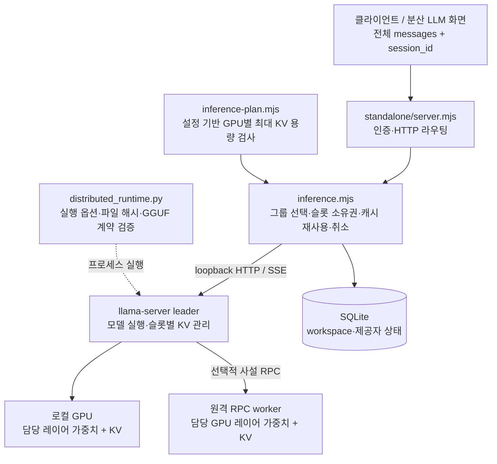

# KV 캐시와 추론 연결 구조 — 현재 코드 분석

분석 기준: 2026-09-27, `C:/gpu_togeter`의 현재 작업 파일. 커밋되지 않은 변경도 포함했다. 기존 설계 문서는 탐색에만 참고하고 아래 결론은 코드와 테스트를 기준으로 작성했다. 실행 코드는 수정하지 않았다.

핵심은 **Relay가 세션과 슬롯을 관리하고, 실제 K/V 텐서는 llama.cpp 실행 엔진이 관리한다**는 것이다. 분산 경로는 고정 GPU 그룹에 모델 레이어와 그 레이어의 KV를 배치하도록 구성한다. 중앙 서버에 전역 KV 저장소를 두는 구현은 없다.

## 1. 연결 구조와 책임



이 그림에서 GPU 배치는 설정과 실행 명령이 요구하는 구조다. 실제 attention 커널, KV allocator, RPC 텐서 전송 구현은 외부 llama.cpp 바이너리에 있으며 이 저장소에 직접 구현되어 있지 않다. RPC가 실제로 어떤 텐서를 얼마나 전송하는지는 이 코드만으로 확정할 수 없다.

| 구성 | 실제 책임 | 코드 근거 |
|---|---|---|
| HTTP 서버 | 관리자 쿠키 또는 임차자 Bearer 키 인증 후 일반 추론/workspace 요청 전달 | S1:98, 104, 118 |
| 자원 계획 | GPU별 레이어·가중치·작업 메모리·여유분·최대 KV가 VRAM에 들어가는지 검사 | S2:76, 134, 149 |
| 추론 gateway | 같은 세션을 가능한 한 같은 그룹·슬롯에 연결하고, 입력 길이·캐시 삭제·응답 완료 검증 | S3:295 |
| 실행기 | 승인 GGUF와 실행파일을 검증하고 llama-server 또는 RPC worker 실행 | S4:126, 168, 276 |
| llama.cpp | 토큰화, prefill, decode, 실제 KV 저장·재사용·해제 | S3의 엔진 HTTP 호출, S4의 실행 옵션으로 위임 |

`RELAY_INFERENCE_CONFIG`를 지정하지 않으면 분산 gateway의 그룹은 비어 있다(S1:25, S3:194). 코드가 존재한다는 사실만으로 현재 실행 환경에서 해당 경로가 켜져 있다고 볼 수는 없다.

## 2. 하나의 요청이 들어왔을 때

1. **전체 대화와 세션 ID 전송.** 화면은 이전 history에 새 사용자 메시지를 더하고 `session_id`와 함께 보낸다(S5:243, 252). 세션 ID는 캐시를 찾기 위한 힌트이며, 대화 내용을 서버에서 복원해 주는 식별자가 아니다.
2. **권한과 요청 검증.** 허용 모델·메시지·출력 상한을 확인한다. 사용자가 `id_slot`, `cache_prompt` 같은 엔진 옵션을 임의로 덮어쓸 수 없다. `session_id`는 엔진에 전달하기 전에 제거한다(S3:137, 174).
3. **그룹·슬롯 선택과 선점.** 동일 세션의 동시 실행은 409, 사용자 동시 실행 한도나 슬롯 포화는 429로 거절한다. 슬롯을 `busy`로 먼저 표시하여 비동기 준비 도중 중복 배정하지 않는다(S3:302–328).
4. **엔진 준비 확인.** health, 슬롯 수, 슬롯별 문맥, 템플릿 해시, 모델 alias를 확인한다. 최초 준비 또는 장애 후 재준비라면 모든 엔진 슬롯이 idle인지 확인한 후 전부 삭제한다. 이미 ready인 정상 그룹은 매번 전부 삭제하지 않는다(S3:263–291).
5. **정확한 토큰 수 검사.** `/v1/chat/completions/input_tokens`로 채팅 템플릿이 반영된 입력 길이를 구한다. `입력 토큰 + max_tokens <= contextTokens`여야 한다. 초과 시 422이며, 이 검사는 기존 세션 KV를 지우기 전에 수행한다(S3:369–379).
6. **캐시 선택과 생성.** 같은 소유자의 유효한 캐시면 `id_slot`을 고정하고 `cache_prompt=true`; 아니면 필요한 슬롯 삭제 응답을 확인한 뒤 `cache_prompt=false`로 생성한다(S3:381–392).
7. **완료 또는 정리.** 정상 응답을 검증한 뒤 슬롯을 비우되 세션 KV는 재사용 후보로 남긴다. 실패·취소된 생성은 삭제 확인 후 슬롯을 반환한다(S3:341–361, 400–435).

즉, 두 번째 질문에서도 **전체 메시지 기록은 다시 전달하지만, 같은 슬롯에 남은 공통 토큰 prefix의 계산을 엔진이 재사용하도록 요청**한다. 같은 `session_id`라도 프롬프트가 바뀌면 전부 적중한다는 보장은 없다. gateway는 prefix를 직접 비교하거나 캐시 적중 토큰 수를 측정하지 않는다.

## 3. KV 캐시의 소유권과 수명

gateway 슬롯에는 실제 텐서 대신 아래 메타데이터가 있다(S3:207).

```text
id          엔진 슬롯 번호
owner       현재 실행 요청의 소유자
cacheOwner  이전에 성공한 캐시의 소유자
cacheEmpty  엔진 삭제 확인을 받은 빈 슬롯인지
busy        실행 또는 정리 중인지
touched     마지막 정상 완료 시각
controller  취소 제어
```

소유권 키는 다음 조합이다(S3:302).

```text
tenant ID + [model, workspace ID 또는 null, session ID]
```

따라서 세션 문자열이 같아도 사용자·모델·workspace가 다르면 같은 캐시로 취급하지 않는다. `session_id`가 없으면 요청마다 임시 ID를 사용하고, 성공해도 다음 요청이 찾아 쓸 `cacheOwner`를 남기지 않는다. 이 경우에도 실제 KV가 즉시 지워지는 것은 아니며 다음 배정에서 정리한다.

재사용 자격은 **마지막 정상 완료 후 300,000ms 미만**, 동일 소유자, 현재 idle인 슬롯이다(S3:309). 5분은 재사용 유효기간이며 자동 삭제 타이머가 아니다. 만료 후 다음 배정, 실패 정리, 실행 공간 종료 등에서 실제 삭제가 이루어진다. 다른 요청이 슬롯을 필요로 하면 5분 전에도 교체될 수 있다.

일반 API의 그룹 선택 우선순위(S3:315): 자신의 warm 캐시 → ready 상태 → unavailable 회피 → warm 캐시를 버리지 않아도 되는 슬롯 존재 → 낮은 사용 비율 → 오래전에 배정한 그룹. 그룹 안에서는 자신의 warm 슬롯을 우선하고, 그렇지 않으면 재사용 가치가 없는 슬롯과 오래된 슬롯을 먼저 고른다(S3:323).

캐시 삭제는 `POST /slots/{id}?action=erase`이며, 반환된 `id_slot`과 `n_erased`를 검사한다(S3:254). 실패나 취소 뒤에는 이 확인을 받을 때까지 슬롯을 점유한다. 삭제 실패 시 그룹 전체를 unavailable로 바꾸고 `epoch`를 갱신하여 기존 실행을 중단한다. 이후 모든 엔진 슬롯이 idle인 상태에서 다시 준비해야 한다. 이는 상태가 불확실한 KV를 새 사용자에게 재배정하지 않기 위한 경계다.

단, 슬롯 삭제 확인은 엔진 캐시의 논리적 정리 확인이다. GPU 프로세스를 종료하거나 선할당된 VRAM 전체를 운영체제에 반환했다는 뜻은 아니다. GPU 제공 종료는 별도로 실행기가 자신이 시작한 프로세스의 종료를 확인하는 절차다(S4:294–310).

## 4. 레이어 분할과 KV 메모리 계산

현재 지원 배치는 `backend=llama.cpp`, `splitMode=layer`다. 설정의 GPU 순서대로 연속 레이어를 배정하며, 모든 레이어를 정확히 한 번 배치해야 한다. 동일 물리 GPU ID는 같은 설정의 여러 그룹에 중복 등록할 수 없다(S2:100, 138, 166).

GPU별 KV 예산은 아래 식으로 계산한다(S2:149).

```text
KV bytes = 슬롯 수 × 슬롯별 최대 문맥 토큰
           × 2(K와 V) × 해당 GPU의 레이어 수
           × KV head 수 × head dimension × 2(f16 바이트)

GPU별 필요 VRAM = 가중치 + 작업 메모리 + 여유분 + KV
```

예를 들어 테스트에 사용한 64레이어·8 KV heads·head dimension 128·문맥 8,192·1슬롯 모델은 전체 KV가 **2,048MiB**다. 32레이어씩 두 GPU에 배정하면 각각 **1,024MiB**이며, 2슬롯이면 각각 **2,048MiB**다. 이 수치는 KV만 포함하며 가중치·연산 작업 메모리·여유분은 별도다.

모든 슬롯이 최대 문맥을 사용하는 경우를 미리 검사하는 보수적 계획이다. 실제 요청마다 입력·최대 출력 길이도 다시 검사하지만, 사용 중인 KV 블록을 세밀하게 측정하여 다른 세션에 동적으로 나누어 주는 allocator는 gateway에 없다. 한 GPU가 부족하면 다른 GPU의 남는 VRAM으로 상쇄하지 않고 구성을 거절한다.

실행 명령도 같은 계약을 사용한다(S4:276).

```text
--split-mode layer
--gpu-layers all --fit off
--ctx-size (슬롯 수 × 슬롯별 문맥) --parallel (슬롯 수)
--no-context-shift --no-kv-unified
--cache-type-k f16 --cache-type-v f16
--cache-ram 0 --no-cache-idle-slots --ctx-checkpoints 0
```

명령에 `--tensor-split`이 들어가더라도 `--split-mode layer`이므로 이 프로젝트의 계획 단위는 레이어다. 실행기는 출력 head까지 고려해 마지막 GPU의 분할 비율에 1을 추가한다(S4:116). 실제 GGUF의 레이어 수, KV head 수, K/V 차원과 설정의 일치도 검사한다. 지원 범위는 단일 GGUF의 dense uniform llama/qwen2/qwen3이며, MLA·SWA·MoE 등 다른 메모리 구조는 거부한다(S4:126–165).

용량 계산은 설정값을 검증하는 것이며 실시간 GPU 메모리 측정이나 다른 프로세스의 사용을 막는 OS 잠금은 아니다.

## 5. 일반 API와 workspace의 차이

| 항목 | 일반 추론 | 실행 공간(workspace) |
|---|---|---|
| 주소 | `/v1/chat/completions` | `/v1/workspaces/{id}/chat/completions` |
| 그룹 | workspace가 점유하지 않은 일치 모델 그룹 중 선택 | 생성할 때 선택한 실행 그룹과 선택적 예비 그룹 점유 |
| 동시 실행 | 그룹 슬롯 수와 사용자 상한 적용 | 공간마다 한 번에 요청 하나 |
| 장애 | 실패 반환; 이후 요청의 그룹 선택은 다시 가능 | 조건에 맞는 장애는 선택된 예비 그룹에서 한 번 재생성 |
| 대화/KV 지속성 | 전체 대화는 요청자가 다시 전달 | 주소·소유권·선택 상태는 저장하지만 전체 대화/KV는 저장하지 않음 |

workspace를 만들 때 실행 그룹과 예비 그룹을 모두 준비한다(S3:474–506). 예비 그룹은 **모델이 준비된 상태**이며 해당 대화의 KV를 복제해 두는 상태가 아니다.

실행 중 장애가 나면 동일한 전체 요청을 예비 그룹에 보내 응답을 처음부터 다시 만든다(S3:594–639). 부분 생성 토큰이나 KV를 옮겨서 마지막 토큰부터 이어 가는 구현은 없다. 복구 후 응답이 원래 부분 응답과 달라질 수 있다.

workspace의 `stream:true`도 기본적으로 정상 완료한 시도의 결과를 모아서 내보낸다. `restart_on_failure:true`를 사용하면 진행 결과를 바로 보내되, 클라이언트가 `relay.restarting`에서 이전 부분 응답을 버리고 `relay.completed`에서 확정하는 규약을 처리해야 한다(S3:617, 626, 638, 648). 일반 추론의 SSE 전달과 구분된다.

SQLite에는 workspace와 GPU 제공 상태가 저장된다(S1:42–49). gateway 재시작 후에는 슬롯 메타데이터가 새로 만들어지고 엔진 준비 과정에서 기존 KV를 지운다. `session_id`나 같은 workspace 주소만으로 이전 KV가 복구되지 않는다. 재시도 결과 영수증도 프로세스 메모리에만 있다(S3:671).

## 6. 일반 GPU 대여/문서 제공자 경로는 별개

`provider/provider.py`는 위 분산 gateway 경로와 다른 작업 실행 경로다.

```text
중앙 작업 상태(engine/service)
    ↕ 제공자 polling: /api/provider
provider.py
    → 해당 PC의 loopback llama-server (--parallel 1)
    → 전체 messages 토큰 검사 → chat/completions → 결과 submit
```

이 worker는 `session_id`, `id_slot`, `cache_prompt`를 명시적으로 제어하지 않는다(S6:391–443). 지속 GPU 대여에서는 같은 모델 프로세스를 여러 턴 동안 유지하지만 캐시 정책은 엔진 동작에 위임한다. 따라서 분산 gateway의 세션별 삭제 ACK·5분 재사용 규칙을 이 경로에도 적용된다고 설명하면 안 된다.

대여 경로의 전체 대화는 중앙 job에 저장된다(S7:142, 235). 이 점도 전체 대화를 요청자가 보내는 분산 API와 다르다. `cached_tokens`는 엔진이 보고한 값이 있으면 검증 후 과금 계산에서 제외하는 용도다(S6:449–464, S7:136, 148). `engine.mjs`의 `reserved`는 크레딧 예약이며 KV VRAM 예약을 뜻하지 않는다.

## 7. 확인된 범위와 아직 확인하지 않은 것

확인된 구현은 고정 그룹의 레이어 배치 계약, 슬롯 단위 세션 친화성, 최대 문맥 기반 용량 검사, 삭제 확인을 기다리는 취소, epoch에 의한 오래된 응답 거부, 선택적 예비 그룹 재생성이다.

gateway에는 동적 GPU 조합, 공정 대기열, 전역 prefix 공유 저장소, KV의 CPU/디스크 계층 이동, KV 복제·이주, prefill/decode를 별도 그룹으로 분리하는 기능이 없다. 여러 gateway 프로세스 사이에서 공유하는 슬롯 잠금도 없다. 실제 엔진의 세부 메모리 관리 기능과 Relay가 직접 제공하는 기능은 구분해야 한다.

실행한 검증:

```powershell
node --test tests/inference-plan.test.mjs tests/inference.test.mjs tests/inference-workspaces.test.mjs tests/inference-http.test.mjs tests/workspace-http.test.mjs
# 77 tests passed, 0 failed

python -m unittest discover -s tests -p distributed_runtime_test.py -v
# 15 tests passed
```

이 결과는 계획·라우팅·캐시 수명·취소·HTTP·복구·실행 옵션의 코드 수준 검증이다. HTTP 테스트의 엔진은 합성 backend이며, 실행기 테스트도 주로 모의 프로세스/응답을 사용한다. 실제 모델을 GPU에 올려 다중 GPU KV 배치, 캐시 적중률, RPC 전송량, 토큰 속도를 측정한 결과는 아니다.

## 코드 근거와 다운로드

아래 ZIP은 이 분석서와 참조 소스 및 실행한 테스트 파일의 사본을 포함한다. 비밀키나 실제 운영 설정은 포함하지 않았다. 줄 번호는 분석 시점 작업 파일 기준이다.

| 번호 | 원본 파일 | 다운로드 사본 | 원본 폴더 |
|---|---|---|---|
| S1 | [server.mjs:98](C:/gpu_togeter/standalone/server.mjs:98) | [ZIP](C:/gpu_togeter/docs/analysis/kv-inference-2026-09-27/analysis-and-sources.zip) | [standalone](C:/gpu_togeter/standalone) |
| S2 | [inference-plan.mjs:149](C:/gpu_togeter/lib/relay/inference-plan.mjs:149) | [ZIP](C:/gpu_togeter/docs/analysis/kv-inference-2026-09-27/analysis-and-sources.zip) | [lib/relay](C:/gpu_togeter/lib/relay) |
| S3 | [inference.mjs:295](C:/gpu_togeter/lib/relay/inference.mjs:295) | [ZIP](C:/gpu_togeter/docs/analysis/kv-inference-2026-09-27/analysis-and-sources.zip) | [lib/relay](C:/gpu_togeter/lib/relay) |
| S4 | [distributed_runtime.py:276](C:/gpu_togeter/provider/distributed_runtime.py:276) | [ZIP](C:/gpu_togeter/docs/analysis/kv-inference-2026-09-27/analysis-and-sources.zip) | [provider](C:/gpu_togeter/provider) |
| S5 | [inference-panel.tsx:243](C:/gpu_togeter/app/inference-panel.tsx:243) | [ZIP](C:/gpu_togeter/docs/analysis/kv-inference-2026-09-27/analysis-and-sources.zip) | [app](C:/gpu_togeter/app) |
| S6 | [provider.py:391](C:/gpu_togeter/provider/provider.py:391) | [ZIP](C:/gpu_togeter/docs/analysis/kv-inference-2026-09-27/analysis-and-sources.zip) | [provider](C:/gpu_togeter/provider) |
| S7 | [engine.mjs:136](C:/gpu_togeter/lib/relay/engine.mjs:136) | [ZIP](C:/gpu_togeter/docs/analysis/kv-inference-2026-09-27/analysis-and-sources.zip) | [lib/relay](C:/gpu_togeter/lib/relay) |

분석서: [파일](C:/gpu_togeter/docs/analysis/kv-inference-2026-09-27/analysis-ko.md) · [다운로드 ZIP](C:/gpu_togeter/docs/analysis/kv-inference-2026-09-27/analysis-and-sources.zip) · [포함 폴더](C:/gpu_togeter/docs/analysis/kv-inference-2026-09-27)
