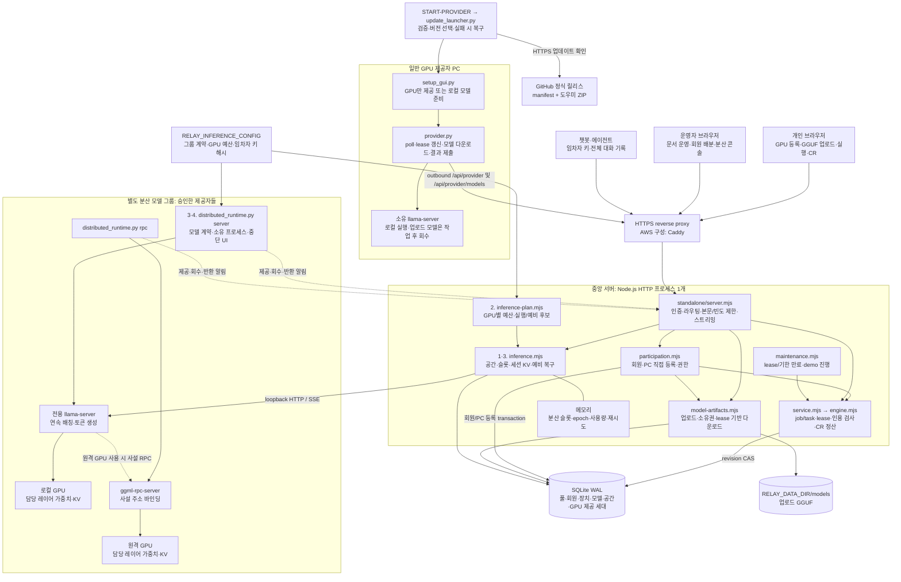
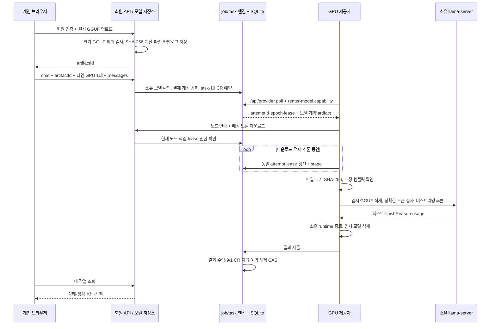
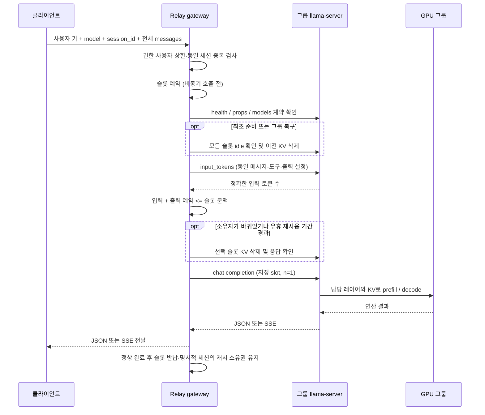

# Relay 0.2 — 전체 구성 아키텍처

기준: **2026-09-22 현재 작업 트리의 소스·설정**. 중앙 서버 패키지는 `0.2.0`, PC 도우미 소스는 `0.4.0`이며 버전 체계가 분리되어 있다. 이 문서는 구성·실행 흐름·상태·정산·신뢰 경계를 설명한다. 운영 중인 AWS 서버가 이 소스와 동일한지는 이번 갱신에서 확인하지 않았다.

실행 명령은 [README](../README.md), 코드 탐색은 [PROJECT_MAP](../PROJECT_MAP.md), 상세 절차는 [참여자 온보딩](participant-onboarding-ko.md)·[분산 LLM 운영](distributed-inference-ko.md)·[AWS 배포](aws-deployment-ko.md)를 참조한다. 설계 근거는 [KV·스케줄링 연구](kv-cache-scheduling-research-ko.md)에 정리되어 있다.

## 1. 목적과 현재 구현 범위

Relay는 **단일 운영자가 관리하는 중앙 서버와 개인 GPU 참여자**로 구성된 파일럿이다. 개인은 계정 복구 파일로 로그인하고 GPU를 직접 등록하거나, 다른 참여자의 GPU에 자신의 모델을 올려 실행한다. 운영자 콘솔은 모델·노드·작업·크레딧과 별도 분산 모델 그룹을 관리한다.

**2026-09-24 개편: [Petals 비교](petals-architecture-decision-ko.md) 후 EC2와 기존 실행기를 유지하고 실행 그룹 하나를 공간의 기본으로 삼았다.** 예비는 선택 사항이며 선택한 경우에만 장애 시 전체 기록으로 한 번 재생성한다. 일반 추론은 미예약 그룹의 빈 슬롯·세션 KV·준비 상태·점유율로 배정한다. 기존 gateway·SQLite·Python 실행기를 재사용한다. [네 계층 구현 계약](distributed-workspace-design-ko.md)은 이 문서의 분산 관리 부분을 구체화한다. 실제 다중 GPU·WAN 속도와 예비 복구 목표는 별도 실측 대상이며 EC2 배포 파일·운영 서버는 이번 소스 수정으로 자동 변경되지 않는다.

| 구분 | 임차인 모델 실행 | 문서별 독립 추론 | 분산 LLM·전용 실행 공간 |
|---|---|---|---|
| 주 용도 | 내 GGUF와 프롬프트를 선택한 다른 참여자의 GPU에서 실행 | 공개 문서의 병렬 추출·인용 검증·종합 | 하나의 모델을 로컬 또는 여러 GPU에 배치해 대화·에이전트에 제공 |
| 진입점 | 개인 화면 → `/api/member/models` + `/api/member/command` | 운영자 `/api/relay`; 회원 명령 API도 문서 작업 지원 | 관리자 `/api/inference/workspaces`, 임차자 `/v1/workspaces`; 일반 추론 API 유지 |
| 실행 엔진 | 제공자가 작업마다 전용 llama-server와 업로드 모델을 준비 | 제공자별 전용 llama-server에서 등록 모델 전체 실행 | 전용 leader llama-server + 원격 ggml-rpc-server |
| 배정 단위 | GPU 1대 선택, `chat` job의 task 1개 | 문서별 task; 제공자 polling으로 병렬 배정 | 공간마다 실행·선택 예비 그룹 독점, 활성 요청 1개; 일반 추론은 미예약 그룹 슬롯 |
| 결과 전달 | 비스트리밍 생성 후 결과 제출·화면 polling | 구조화 결과 제출·검증·결정적 병합 | JSON 또는 SSE |
| 영속성 | 프롬프트·응답·task·원장·영수증은 SQLite, GGUF는 별도 파일 | 문서·task·원장·영수증은 SQLite | 설정은 파일, 공간·제공 세대는 SQLite; 대화·진행 요청·슬롯·재시도 영수증은 메모리 |
| 정산 | 완료 요청당 10 CR: 제공자 9, 운영자 1 | 완료 문서당 10 CR: 제공자 9, 운영자 1 | 선택한 그룹 비용 합산 표시; 임대·토큰 자동 과금 미구현 |
| 네트워크 | 제공자 → 중앙 서버 outbound HTTPS, 모델 다운로드 포함 | 제공자 → 중앙 서버 outbound HTTPS | 클라이언트 HTTPS + leader loopback HTTP, 원격 GPU가 있으면 사설 RPC |

앞의 두 경로는 같은 `local-owner` 풀의 job/task·lease·CR 엔진을 사용한다. 문서 체험 `demo`는 규칙 기반 fixture이며 실제 실행 `live`와 계정·작업·원장이 분리된다. 회원은 `live`만 이용한다. 분산 LLM은 이 book과 별개이며 `RELAY_INFERENCE_CONFIG`가 없으면 비활성이다.

하위 엔진과 관리자 명령에는 제공자의 기존 등록 모델로 실행하는 `llm-chat-v1`도 있다. 현재 **개인 화면·회원 chat API는 소유한 업로드 모델이 필요한 `renter-model-v1`**을 사용한다. 이 요청형 GPU 이용과 고정 분산 그룹은 서로 다른 기능이다. 자동 가격 협상·동적 다중 GPU 그룹 조립·실화폐 결제·불신 제공자의 실행 증명은 구현하지 않았다.

## 2. 전체 구성도



로컬 개발은 proxy 없이 loopback으로 접속할 수 있다. **중앙 Node 서버는 LLM 연산을 실행하지 않는다.** 일반 제공자 PC가 모델 실행을 소유하며, 분산 경로는 별도 leader/RPC 프로세스가 연산을 소유한다. 원격 leader를 사용할 때도 gateway upstream은 인증된 로컬 터널의 loopback endpoint로 제한한다.

업로드 GGUF는 중앙 서버를 경유하지만 분산 KV tensor는 SQLite나 문서 결과에 저장·병합하지 않는다. 여러 PC의 VRAM을 하나의 CUDA 메모리 공간으로 자동 통합하는 구조가 아니다.

## 3. 모듈과 책임

현재 웹 실행 경로는 **React 19 + TypeScript + Vite SPA**다. `standalone/entry.tsx`가 `app/page.tsx`를 렌더하며, 파일명이 `page.tsx`여도 현재 서버가 Next.js 라우팅을 사용하는 것은 아니다.

| 계층 | 구현 | 책임 |
|---|---|---|
| 화면 진입·운영 | [page.tsx](../app/page.tsx), [service-home.tsx](../app/service-home.tsx), [setup-guide.tsx](../app/setup-guide.tsx) | 공개 서비스 진입, 관리자 로그인·문서 운영·설정 안내 |
| 개인 계정·GPU 이용 | [participant-panel.tsx](../app/participant-panel.tsx) | 복구 파일 로그인, PC 등록·연결 파일, GGUF 업로드·실행·상태 조회, 개인 CR·운영자 배분 화면 |
| 분산 화면 | [inference-panel.tsx](../app/inference-panel.tsx) | 실행·예비 후보·공간 생성/종료·연결 설정 저장·복구 표시, 전체 기록 재전송·화면 이탈 시 취소 |
| HTTP·저장 연결 | [server.mjs](../standalone/server.mjs), [client-address.mjs](../standalone/client-address.mjs), [launch-auth.mjs](../standalone/launch-auth.mjs) | 관리자 세션, 라우팅, proxy 주소 검증, SQLite 연결, 정적 파일·스트림·종료 처리 |
| 회원·PC 등록 | [participation.mjs](../standalone/participation.mjs) | 회원/노드 키 분리, 가입 CR, 직접 등록, 소유권 확인, 공개 도우미 다운로드, 구 승인 흐름 호환 |
| 업로드 모델 | [model-artifacts.mjs](../standalone/model-artifacts.mjs) | 소유자별 파일 카탈로그·용량 제한, 업로드/다운로드 스트리밍, 진행 작업의 삭제 방지 |
| 작업·정산 | [service.mjs](../lib/relay/service.mjs), [engine.mjs](../lib/relay/engine.mjs), [maintenance.mjs](../standalone/maintenance.mjs) | 회원 권한·멱등성·revision CAS, task/attempt/lease, CR 원장·인용 검사, 서버 유지보수 |
| 분산 계획·요청 | [inference-plan.mjs](../lib/relay/inference-plan.mjs), [inference.mjs](../lib/relay/inference.mjs) | GPU별 용량·동일 모델 후보, 공간 독점·권한·슬롯·토큰·KV 삭제, JSON/SSE·예비 재생성 |
| 일반 제공자 | [provider.py](../provider/provider.py), [setup_gui.py](../provider/setup_gui.py) | 실행 환경 검사, polling·lease watchdog, 모델 전달·추론·소유 프로세스 회수 |
| 설정·탐색 | [setup.mjs](../lib/relay/setup.mjs), [gguf_metadata.py](../provider/gguf_metadata.py), [model_discovery.py](../provider/model_discovery.py), [runtime_discovery.py](../provider/runtime_discovery.py), [connection_discovery.py](../provider/connection_discovery.py) | 계약·연결 JSON, 제한된 로컬 탐색, GGUF·템플릿 읽기; 탐색만으로 추론을 시작하지 않음 |
| 분산 실행기 | [distributed_runtime.py](../provider/distributed_runtime.py) | leader/RPC 소유·중단 UI·반환 확인·인증 상태 알림, 사설 주소·파일 해시·GGUF 계약·레이어 배치 |
| 시작·도우미 배포 | [launch.mjs](../scripts/launch.mjs), [provider-archive.mjs](../standalone/provider-archive.mjs), [update_launcher.py](../provider/update_launcher.py) | 로컬 서버 시작, 도우미 ZIP, GitHub 업데이트 검증·버전 복구 |
| 서버 배포 | [package-server.mjs](../scripts/package-server.mjs), [deploy/aws](../deploy/aws/compose.yaml) | 사전 빌드 배포 ZIP, Docker Compose·Caddy·영속 볼륨·백업 |

기존 llama.cpp·표준 라이브러리·프로세스 경계를 재사용하며 자체 attention/KV allocator나 독자 tensor 전송 프로토콜은 구현하지 않는다. `public/provider.py` 등 공개 배포 사본과 `provider/` 소스는 별도로 존재하고, 도우미 ZIP의 기준은 `provider-archive.mjs`의 명시적 파일 목록이다.

## 4. 개인 계정·GPU 등록과 제공자 수명

1. 개인 화면에서 이름과 별도 계정 키로 등록한다. 브라우저가 만든 ID·키를 담은 **계정 복구 JSON**을 저장하며, 서버는 키의 해시만 저장한다. 회원 인증은 `X-Relay-Member`와 Bearer 키를 사용한다.
2. 회원 등록과 `member-<id>` CR 계정 생성·가입 크레딧 지급은 같은 SQLite transaction으로 확정한다. 기본 가입 지급은 100 CR이며 `RELAY_SIGNUP_CREDITS`로 0~1000 CR을 지정한다. 기존 `requester`의 초기 1000 CR과는 별도다.
3. PC 도우미의 기본 모드는 **GPU만 제공**이다. 로컬 llama-server 실행파일과 문맥 설정을 검사해 `runtimeOnly: true` 계약을 만든다. 모델·템플릿 digest는 자리표시 값이며 제공자 자신의 GGUF는 필요하지 않다. 로컬 모델 제공 모드는 GGUF·템플릿·실행파일의 해시를 검사한다.
4. 회원이 웹에서 계약과 PC 정보를 제출하면 모델 계약을 재사용하거나 등록하고, 소유 회원의 CR 계정에 연결된 노드를 만든다. 관리자 승인 대기 없이 연결 설정을 받는다. 장치 등록 기록과 풀 변경은 revision 확인을 포함한 같은 SQLite transaction으로 확정된다.
5. **PC 연결 JSON**에는 서비스 주소·노드·모델 계약과 별도 노드 키가 들어간다. 계정 복구 키와 노드 키의 재사용은 거부한다. 기존 등록 요청은 같은 ID·내용으로 재시도할 수 있고, 다른 내용은 거절한다.
6. 도우미는 다운로드 폴더의 연결 파일을 감지하되 실행 중이거나 선택한 연결을 자동 교체하지 않는다. **검사하고 참여 시작**을 눌러야 worker가 시작되고 **참여 중지**로 소유 프로세스를 회수한다.

GPU-only worker는 임차인 모델이 배정되기 전 자체 모델을 적재하지 않는다. 기존 로컬 모델로 실행한 문서·chat 작업은 정상 제출 뒤에도 runtime을 유지하며, 업로드 모델은 작업마다 runtime과 임시 파일을 정리한다. 도우미의 파일 탐색·등록·연결 설정 불러오기는 GPU 실행 동의와 분리되어 있다. 런타임 실행파일은 사용자가 준비하며, 작업이 배정된 뒤의 **임차인 GGUF 다운로드**는 worker 실행 과정에 포함된다.

회원은 자신의 작업·GPU·잔액·관련 원장만 조작한다. 여러 PC의 기여 수익은 동일 회원 계정으로 모인다. 다른 회원의 노드는 공개 연결·모델·VRAM 정보로 표시하며 키·잔액·작업 원문은 회원 조회에서 제외한다. 회원이 비용을 지불하는 작업은 자신의 GPU에 배정하지 않는다.

등록 VRAM·연결 표시와 파일 해시는 실제 GPU 용량·연산 성공의 증명이 아니다. GPU-only 직접 등록에는 업로드 모델별 정밀 VRAM 계획 검사가 없으며, 실행 가능 여부는 제공자에서 모델 적재·토큰 검사를 거쳐 확인한다.

## 5. 임차인 GGUF 업로드와 요청형 LLM 실행



업로드는 인증 후 `RELAY_DATA_DIR/models/<artifactId>.gguf`로 스트리밍한다. 서버는 Content-Length·파일명·GGUF v2/v3 헤더·크기·저장 여유를 확인하고, 받은 바이트의 SHA-256을 계산해 카탈로그에 저장한다. 클라이언트가 제시한 기대 해시와 비교하는 단계는 없다. 이 검사는 모델 전체의 실행 호환성을 보증하지 않는다. 실제 내장 템플릿 읽기와 모델 적재는 제공자가 수행한다.

모델 다운로드에는 노드 Bearer 키와 `X-Relay-Node`가 필요하다. 해당 모델을 참조하는 작업의 현재 유효 lease를 가진 노드에만 전달하고, 전송 중에도 1초 간격으로 권한을 재확인한다. 실행자가 임의 URL이나 런타임 경로를 지정할 수 없다. 제공자는 서버가 준 크기·해시를 검증하고 단일 GGUF의 내장 채팅 템플릿으로 실행한다.

진행 단계는 `downloading → loading → running`이며 다운로드·적재 실패도 lease/재시도 정책을 따른다. 다운로드·실행을 마치면 제공자의 임시 모델 사본을 제거하지만 **중앙 서버의 업로드 원본은 사용자가 삭제할 때까지 유지**한다. 대기·실행 task가 참조하는 파일은 삭제할 수 없고, 작업 생성과 삭제의 경합은 단일 프로세스의 예약 상태로 막는다.

회원 화면은 프롬프트 실행 작업을 생성하고 결과를 polling한다. 코어는 텍스트 `system/user/assistant` 기록을 지원하지만 이 경로에 SSE·도구 호출·상시 적재 API endpoint는 없다. 입력과 출력은 job에 저장되고 보관 시 제거된다. 결과 `generated`는 생성·정산 완료를 뜻하며 문서 인용 검사나 의미적 정답 인증이 아니다.

## 6. 문서 추론과 공통 task·정산 계약

문서 작업은 제공자가 준비한 등록 모델 전체를 사용한다. 운영자 또는 허용된 회원 명령으로 원문 스냅샷·추출 필드·모델·예산·기한을 제출하면 중앙 서버가 task별 비용을 예약한다. 공급자가 polling할 때 모델·문맥·VRAM·허용 노드 조건과 작업 간 순환 배정을 적용한다. GPU-only 자리표시 모델로 문서 작업을 요청할 수 없다.

제공자는 결과를 제출하고 중앙 서버는 원문에서 정확한 인용·UTF-16 위치를 검사한 뒤 필드를 결정적으로 병합한다. JSONL·CSV·Markdown 내보내기를 지원하며 종합을 위한 별도 LLM 호출은 없다. 인용 품질 실패도 실행 정산과 구분하고, 품질 재호출은 새 task와 새 10 CR 예약이다.

| 계약 | 현재 동작 |
|---|---|
| 배정 | 노드당 활성 lease 1개, lease 30초; `attemptId`·숫자 `epoch`·노드·서버 시각을 함께 검사 |
| 시도 hard stop | 문서·등록 모델 chat는 180초; 업로드 모델 chat는 최대 3600초. 모두 job 기한을 넘지 못함 |
| chat job 기한 | 업로드 모델은 생성 후 60분, 등록 모델 chat는 30분 |
| 재시도 | 기술적 시도 최대 3회, 미완료 시 기한 안에서 재배정. 갱신 요청으로 새 task를 받지 않음 |
| 과금 | 문서 1개 또는 chat 요청 1개 완료당 10 CR, 제공자 9·운영자 1. 자가보고 usage로 금액을 바꾸지 않음 |
| 원자성 | 결과 수락·지급·예약 해제를 풀 revision CAS로 한 번에 확정; 충돌 시 최신 상태·시각으로 최대 10회 재시도 |
| 취소·실패 | 미사용 예약 해제, 이미 확정한 지급 유지; 오래된 실행 결과는 거절 |
| 멱등성 | 생성 명령 `requestId`는 최근 24시간·512개, 완료 task 결과 영수증·해시는 보관 후에도 중복 지급 방지에 사용 |

기본 1초 서버 유지보수 루프가 lease·작업 기한 만료와 체험 진행을 처리한다. 브라우저가 닫혀도 이미 제출한 task는 계속 진행하며, 재시작 뒤 SQLite에서 만료 처리를 재개한다. 제공자는 갱신 응답과 독립된 watchdog으로 권한 만료를 감시하고 자신이 시작한 runtime을 회수한다. 서버의 lease 종료 시각과 실제 GPU 메모리 반환 완료는 구분해야 한다.

## 7. 분산 모델 준비와 요청 흐름

### 네 계층 통합과 실장비 검증 경계

사용자는 하나의 모델 endpoint에 요청하고, 실행 엔진이 그 요청의 계산·가중치·KV를 여러 PC의 GPU에 배치한다. 에이전트는 이 endpoint로 추론·도구 호출 생성을 반복한다. 에이전트의 도구 실행과 외부 API 대기 시간은 GPU 분산 추론 시간과 별도로 측정한다. 일반 프로그램에 단일 가상 CUDA 장치를 제공하는 것은 목표에 포함하지 않는다.

현재 `--split-mode layer`는 **같은 요청의 앞 레이어 계산 결과를 다음 GPU의 뒤 레이어로 전달**한다. 각 GPU가 독립된 답변을 생성해서 합치는 방식이 아니다. 다만 레이어 분할만으로 한 요청의 지연 감소나 여러 stage의 실행 중첩을 보장하지 않는다. 텐서 병렬은 같은 레이어 내부의 계산을 GPU들이 나누는 별도 실행 방식이며 현재 미구현이다.

LAN/WAN 모두 동일한 사용자 API와 성능 판정 원칙을 사용하되, 실행 배치는 실제 통신 성능에 맞춘다.

| 연결 환경 | 검증할 실행 방식 | 판단 기준 |
|---|---|---|
| 한 PC 내부 또는 고속으로 연결된 PC들 | 텐서 병렬과 레이어/파이프라인 병렬 비교 | 실제 GPU 연결·대역폭·지연과 모델 호환성. LAN이라는 이름만으로 텐서 병렬을 선택하지 않음 |
| 일반 LAN 또는 인터넷으로 연결된 PC들 | 연속 레이어 분할을 기준선으로 측정하고, 원격 단계 수와 전송량을 줄이는 배치 비교 | GPU별 계산 시간, 네트워크 지연·변동, 긴 prompt 전송·prefill, 사용자별 생성 속도 |

이는 설계 방향이다. 현재 엔진을 우선 측정하고, 목표 미달 원인이 확인되면 지원 모델과 환경에 맞는 기존 분산 엔진을 비교한다. 텐서 병렬의 빠른 노드 간 통신 요구와 TP/PP 조합은 [vLLM 공식 문서](https://docs.vllm.ai/en/latest/serving/parallelism_scaling/)를 참고한다. 인터넷 분산 실행 사례인 [Petals](https://github.com/bigscience-workshop/petals)의 지원 모델·공개 성능도 이 서비스의 GGUF 호환성이나 목표 속도 달성을 증명하지 않는다.

인터뷰에서는 **구성별 속도와 가격을 공개하고 사용자가 선택하는 정책**을 확정했다. 앞서 제안한 ‘첫 응답 3초·초당 20토큰’은 공통 합격선으로 채택하지 않았다. 같은 모델·양자화·문맥·엔진·GPU 배치 조건의 실측과 추정을 구분하고, 예비를 선택하면 그 비용도 함께 제시한다. 한 실행 공간의 활성 추론 요청은 1개다.

제공자는 필요할 때 GPU 제공을 중단할 수 있다. 서비스는 반환을 붙잡지 않으며 예비를 선택한 공간만 같은 모델이 적재된 예비 그룹으로 자동 교체한다. 예비 없는 공간은 요청 실패를 반환하고 자동 우회하지 않는다. 예비 복구는 미완료 응답을 폐기하고 대화 기록으로 재생성하며, 회수 감지부터 응답 재시작까지 **1분 이내를 목표**로 한다. 전체 답변 완료 시간이나 GPU 반환 시간의 제한은 아니다. 에이전트의 실제 도구 실행은 이 자동 재생성 범위에 포함하지 않는다.

**현재 실행 공간·선택적 예비 예약·예비가 있는 경우의 자동 재생성·성능 선언 검증을 구현했다.** 그룹 `ready`는 엔진 계약 확인 성공이고 공간 `ready`는 선택한 그룹 모두의 준비 성공이며 속도 합격 표시가 아니다. 예비가 없어도 공간은 `ready`가 될 수 있다. `generationMs`나 SSE chunk 개수로 decode 속도를 추정하지 않는다. 계층별 입력·출력과 클라이언트 계약은 [실행 공간 설계](distributed-workspace-design-ko.md)에 정리한다.

| 책임 | 재사용 구현 | 현재 경계 |
|---|---|---|
| 1. 실행 공간 | `inference.mjs`, `inference-panel.tsx`, 서버 SQLite | 고정 주소·소유권·단일 활성 요청·공간 수명·복구 표시 |
| 2. 자원 구성 | `inference-plan.mjs`와 gateway 예약 | 등록 그룹 중 실행 1개 기본·예비 1개 선택 후보, 비용·성능 선언, 독점 예약 |
| 3. 모델 실행 | gateway·llama.cpp·`distributed_runtime.py` | GPU별 연산·KV, 전체 기록 재생성, 이전 epoch 결과 차단 |
| 4. GPU 제공·회수 | `distributed_runtime.py --gui`와 상태 API | 로컬 소유 프로세스 종료 확인·인증 알림, 중앙 복구와 독립 |

공간 생성은 후보 ID·이름을 받고 선택한 그룹의 엔진 계약과 KV 초기화를 확인한다. 단일 후보는 `id=group.id`, `standbyGroupId:null`, `groupIds:[id]`이고 예비 포함 후보는 기존 `primary~standby`다. 동일 모델의 GGUF·템플릿 해시·양자화·엔진 버전·문맥·아키텍처를 고정하고 선택한 그룹의 `hourlyCost`만 같은 `currency`로 합산한다. 선택한 그룹의 가격이 빠지면 선택 불가다. `performance.source`의 실측 선언과 추정을 구분하되 운영자의 선언을 자동 벤치마크하지 않는다. 성능 조건은 선택한 모든 그룹이 실측 선언으로 만족해야 한다. 모델 적재·호스트 준비는 운영자가 수행하며 예비 미선택이 기존 예비 프로세스를 자동 중지하지는 않는다.

공간마다 `/v1/workspaces/<id>/chat/completions`를 유지한다. 생성 때 한 번 반환하는 `accessKey` 또는 소유 임차자 키로 이 주소를 호출한다. 공간 키는 추론에만 쓰며 해시만 저장한다. 화면은 연결 설정 JSON을 저장할 수 있다. 공간마다 활성 요청 1개, 후속 동시 요청은 409이고 선택한 그룹은 다른 공간·일반 요청과 공유하지 않는다. 종료는 진행 작업·KV 정리를 기다리고 예약을 해제하며 native 프로세스를 원격 종료하지 않는다.

### 그룹 준비

운영자는 [그룹 JSON](examples/inference.config.json)에 모델·템플릿 해시, 장치별 레이어와 VRAM 예산, 슬롯·문맥, 허용 임차자를 지정한다. 같은 파일을 gateway와 leader 실행기가 읽는다. 설정은 시작 시 로드하며 hot reload·임의 GPU 동적 조립은 구현하지 않았다. 예비를 선택한 공간은 장애 시 그 그룹으로 전환한다. 한 호스트의 GPU만 쓰면 실행기의 `--rpc`와 `--trusted-private-network`를 생략할 수 있다.

Node planner는 물리 GPU ID·endpoint 중복과 GPU별 용량 초과를 거부한다. 같은 모델 alias를 여러 그룹에 사용할 수 있지만 정확한 모델·템플릿 해시·양자화·엔진 버전·문맥·아키텍처가 같아야 한다. 이는 **정적 구성의 독점 선언**이다. OS 차원의 GPU 잠금이나 여러 Relay 프로세스 사이의 분산 lock은 아니다. 한 그룹은 전용 엔진 1개·Relay 프로세스 1개로 운영하고, 같은 GPU를 일반 provider worker나 다른 프로세스에 중복 제공하지 않는다.

실행기는 실행파일·GGUF·템플릿의 SHA-256과 실제 GGUF의 레이어·KV head·K/V 차원·문맥을 검사한다. 현재 dense `llama`, `qwen2`, `qwen3`의 균일한 full-attention MHA/GQA·f16 KV·단일 GGUF만 지원한다. 지원하지 않는 MLA·SWA·MoE·hybrid/recurrent·공유 KV·NextN/MTP 등의 메타데이터는 시작 전에 거부한다.

b10964의 전체 GPU offload는 출력 레이어까지 `N+1`로 분할한다. 실행기는 선언한 반복 레이어 수의 마지막 항목에 1을 더해 비율을 만든다. 예를 들어 `32/32` 레이어는 `--tensor-split 32,33`이다. 입력 embedding은 CPU에 남으며, 마지막 GPU의 예산에는 출력 가중치가 포함되어야 한다. 장치 순서·실제 peak 메모리는 실행 로그와 부하 측정으로 확인한다.

### 요청 처리

아래는 공통 슬롯 처리다. 공간 요청은 먼저 선택한 그룹의 독점 예약·공간 소유권·단일 요청을 검사한다. 일반 `/v1/chat/completions`는 같은 모델의 미예약·제공 가능·빈 슬롯 그룹 중 같은 임차자·모델·공간·세션의 5분 이내 KV, `ready → unchecked → unavailable`, 빈/만료 캐시 슬롯 존재, 낮은 슬롯 점유율 순으로 고른다. 동률이면 최근 배정이 오래된 그룹을 먼저 선택한다. `unavailable`이면서 활성 슬롯을 정리 중인 그룹은 제외한다. 사용자 동시 상한은 전체 그룹에 적용한다. 일반 요청을 실패 직후 다른 그룹에 자동 재전송하지 않으며 다음 요청에서 갱신된 상태로 다시 선택한다. [실제 코드 비교·변경 근거](reports/routing-kv-review-ko.md)를 참조한다.



문맥 초과는 422이며 입력을 임의로 자르지 않는다. 준비된 그룹의 입력 검사 실패·문맥 초과·토큰 검사 중 취소는 기존 KV와 캐시 시각을 보존한다. 슬롯 또는 사용자 상한에 도달하면 대기열에 누적하지 않고 429와 `Retry-After`를 반환한다. 같은 임차자·모델·공간·세션의 동시 요청은 409다. 유효한 옵션이라도 모델이 거절한 400/422는 해당 요청의 오류로 처리한다. JSON/SSE 응답 전달에는 Node stream pipeline을 사용해 소비 속도와 연결 종료를 upstream에 전달한다.

에이전트의 함수 정의, `tool_calls`, 도구 응답, assistant의 `reasoning_content`를 대화 기록으로 전달할 수 있다. **Relay는 도구를 실행하지 않는다.** 멀티모달 URL·파일, 임의 backend URL·slot·`n_predict`·모델 적재 옵션은 허용하지 않는다.

## 8. KV 위치·예약·사용자 격리

모델 가중치는 그룹 내 사용자들이 공유한다. KV는 엔진이 관리하는 각 시퀀스에 속하며, 각 GPU에는 자신이 맡은 레이어의 KV가 놓인다. 같은 논리적 토큰 기록을 모든 담당 레이어가 처리하므로 물리 위치가 나뉜다는 이유로 대화 문맥이 끊어지지 않는다.

여기서 GPU별 메모리는 **하나의 모델 계산을 나누어 배치한 물리 위치**다. 사용자의 요청·모델·대화는 하나이며 각 GPU의 부분 계산이 연결된다. 물리 메모리가 분리되어 있다는 사실과 공동 계산 여부는 별개의 문제다.

```text
GPU별 KV bytes/token = 2(K,V) × 담당 레이어 × KV heads × head dimension × 2(f16)
GPU별 KV MiB = KV bytes/token × 슬롯별 contextTokens × slots / 1048576
GPU별 필요량 = weightsMiB + workspaceMiB + reserveMiB + KV MiB
모든 GPU에서 필요량 <= 그 GPU에 허용한 vramMiB
```

다른 GPU의 여유 VRAM으로 한 GPU의 초과를 상쇄하지 않는다. 모든 슬롯의 최대 문맥을 사전 계산하는 보수적 정책이며, 실제 workspace·가중치·여유 수치는 운영자가 측정해 넣는다. 전체 KV pool의 동적 overbooking·PagedAttention 자체 구현은 없다.

예를 들어 허용량이 각각 24GiB인 두 GPU에 필요량을 28GiB/8GiB로 배치하면 총합이 48GiB 이하여도 첫 GPU에서 실패한다. 레이어 배치를 바꾸면 각 장치의 필요량을 조정할 수 있지만, 현재 실행기는 이를 자동으로 재배치하지 않는다. 이 제한은 “여러 GPU가 한 모델을 실행하지 못한다”는 의미가 아니다.

- 캐시 소유권은 **인증된 tenant + model + workspace + session_id**로 구분한다. 실제 키는 `tenant + ":" + JSON.stringify([model, workspace, session_id])`이며 관리자 화면은 `operator` namespace를 사용한다. 다른 사용자·모델·공간의 같은 session_id는 다른 소유자다.
- 진행 중 `owner`와 재사용 가능한 `cacheOwner`를 분리한다. 캐시 삭제 중에도 요청의 슬롯·사용자 예약이 사라지지 않는다.
- 같은 세션이 5분 이내에 자신의 유휴 슬롯을 다시 얻으면 prefix를 재사용한다. 그다음 빈/만료 캐시 슬롯, 다른 세션의 LRU 순으로 선택하며 필요한 삭제를 확인한 후 생성한다. 세션 ID 없는 완료 요청은 `cacheOwner:null`이다. 5분은 재사용 판단 기준이며 정확히 그 시각에 GPU 메모리를 지우는 주기적 TTL 작업은 아니다.
- 다른 세션이 슬롯을 사용할 수 있으므로 `session_id`가 슬롯을 영구 예약하지 않는다. 매 턴 전체 대화 기록을 보내며, KV 유실·선점 후에는 prefill을 다시 수행한다.
- 실행기는 공유 RAM prompt cache·자동 context shift·자동 fit을 끄고 슬롯 문맥을 고정한다. 슬롯 삭제는 논리적 캐시 제거이며 제공자 호스트로부터의 기밀성이나 물리 메모리 zeroization을 증명하지 않는다.

## 9. 상태·취소·장애 복구

문서·chat task의 숫자 `epoch`와 분산 그룹의 UUID `epoch`는 별개의 상태다. 분산 그룹은 `unchecked`, `ready`, `unavailable`을 사용한다. `ready`는 마지막 계약 확인이 성공했다는 관측 상태이며 화면 조회 자체가 지속적인 GPU health probe를 수행하는 것은 아니다. 요청마다 계약을 확인하되 동일 그룹의 동시 검사는 `group.preparing`으로 공유한다. 검사 실패는 시작 당시 epoch가 여전히 같을 때만 그룹을 무효화한다.

공간은 `preparing`, `ready`, `recovering`, `degraded`, `unavailable`, `stopped`를 사용한다. 실행 그룹 실패 시 예비가 있으면 처음 선택한 예비로 한 번 재생성하고 이후 `degraded`로 남는다. 예비가 없으면 자동 우회하지 않는다. 예비 자동 보충·원래 그룹으로의 왕복 전환은 없다. `recoveryTimeoutMs`는 장애 감지부터 대체 엔진의 첫 실제 출력까지 기본·최대 60초이며 기존 KV 정리 시간도 포함한다. JSON 요청도 내부 SSE로 첫 출력을 관찰한다. 전체 생성 제한 `requestTimeoutMs`와 GPU 반환 시간은 별도다.

제공자는 분산 실행기의 `--gui` 중단 버튼이나 Ctrl+C로 소유 프로세스를 회수한다. `providing → reclaiming → released` 중 반환 완료는 소유 프로세스 종료 확인 뒤에만 보낸다. 상태 알림은 로컬 반환을 막지 않으며, `runtimeId`·`startedAt`·승인 키 해시를 SQLite에 보존해 재시작 이후의 늦은 알림도 구분한다. 실제 다른 프로세스의 GPU 점유까지 측정한 상태는 아니다.

| 사건 | 문서·요청형 chat 경로 | 분산 LLM 경로 |
|---|---|---|
| 브라우저 닫힘 | 서버 timer·제공자 lease는 계속 동작 | 해당 화면의 진행 요청 취소; 정리 확인 후 슬롯 반환 |
| 한 요청 취소/시간 제한 | 해당 task 실행 권한·예약 처리 | 생성 호출 전 입력 검사 취소는 기존 KV·캐시 시각 보존; 시작한 erase는 ACK 대기; 생성 호출 후에는 삭제 확인 뒤 반환 |
| 엔진 계약 불일치 | 제공자/결과 계약 검사에서 거절 | 그룹을 unavailable로 격리하고 epoch 변경·진행 요청 중단 |
| 엔진 연결 오류 | lease 만료·시도 수/기한에 따라 재배정 또는 종료 | 해당 슬롯 정리를 시도; 정리 확인 실패 시 그룹 격리 |
| GPU 그룹 복구 | 해당 없음 | 활성 요청이 없고 엔진의 모든 슬롯이 idle임을 확인한 뒤 이전 KV 삭제·재준비 |
| 서버 재시작 | SQLite 상태에서 만료 처리·정산 이력 복원 | 공간 ID·선택·키 해시·제공 세대 복원; 슬롯·진행 요청·영수증은 유실, 엔진 idle/KV 재검사 |
| 중간 출력 유실 | 확정 task 결과 보존, 미완료 task 재시도 정책 적용 | 예비 포함 공간만 한 번 재생성; 단일 공간·일반 요청은 클라이언트가 확정 기록으로 재요청 |

분산 그룹의 공유 준비 확인과 개별 요청의 대기는 분리되어 있다. 한 요청이 취소·timeout 되더라도 다른 사용자의 준비·실행을 불필요하게 중단하지 않는다. KV 사용 후에는 동일한 cleanup 완료를 기다리고, 최대 5초 안에 슬롯 삭제 확인을 받지 못하면 그룹을 격리한다. 읽지 않는 SSE 소비자도 취소·timeout 정리를 막을 수 없도록 downstream의 다음 읽기와 독립적으로 cleanup을 시작한다.

JSON 응답은 assistant 내용과 완료 사유를 검증한다. SSE는 UTF-8·프레임 경계를 유지해 증분 파싱하며 유효한 assistant 완료·`[DONE]`·스트림 종료를 확인한다. 오류 이벤트·잘못된 구조·미완료 스트림은 성공으로 집계하지 않는다. 클라이언트는 미완료 도구 호출을 실행하거나 완료 기록으로 확정하면 안 된다.

공간 SSE는 기본적으로 검증이 끝난 시도만 전달한다. 즉시 조각이 필요한 클라이언트는 `restart_on_failure:true`를 보내고 `relay.restarting`의 `discard:true`에서 기존 부분 응답·미완료 도구 호출을 버린다. `relay.completed`가 확정 신호이므로 이 모드에서는 `[DONE]`만 보고 도구를 실행하지 않는다. 호환 모드의 화면 첫 출력은 전체 생성 후이며 내부 첫 출력 복구 지표와 구분한다.

비스트리밍의 선택적 `Idempotency-Key`는 tenant별 요청 fingerprint와 실행 기록을 보관한다. 같은 키의 실행 중·결과 불확실 요청과 다른 본문은 409이며, 저장된 완료 응답은 재전송한다. 서버 재시작을 넘는 exactly-once나 유료 정산의 영속성을 보장하지 않는다. task 경로의 SQLite 영수증과 혼용하지 않는다.

분산 `outputTokens`는 JSON/SSE에 실제로 포함된 유효한 completion token 사용량만 집계한다. usage가 없는 스트림은 토큰 수를 만들어 채우지 않는다. `generationMs`에는 준비·입력 토큰 검사도 포함된다. 이 수치는 참고 통계이며 정밀 GPU 실행 시간이나 CR 과금 근거가 아니다.

## 10. 저장·수명과 재시작 경계

기본 데이터 위치는 `RELAY_DATA_DIR` 또는 프로젝트의 `.relay`다. SQLite는 WAL 모드이며 현재 풀은 `local-owner` 하나다.

| 데이터 | 위치 | 수명·원자성·재시작 동작 |
|---|---|---|
| demo/live 계정·모델·노드·job/task/attempt·CR 원장·명령/결과 영수증 | `relay.sqlite`의 `relay_pools(id, revision, state)` | 풀 전체 JSON을 revision CAS로 확정. task 결과·정산·예약 해제는 같은 변경 |
| 회원 ID·이름·계정·키 해시 | `relay_members` | 영속; 회원 등록과 풀의 가입 CR을 같은 transaction으로 확정 |
| PC 소유자·등록 requestId/fingerprint·노드 키 해시 | `relay_member_devices` | 영속; 직접 등록 재시도와 노드 연결 관계 유지 |
| 이전 승인형 참여 요청 | `relay_participation` | 호환 조회용. 신규 승인 신청·승인 변경 경로는 410, 요청 목록은 빈 목록 |
| 업로드 모델 정보 | `relay_model_artifacts` | 소유 회원·이름·해시·크기 저장; GGUF 본문은 포함하지 않음 |
| 업로드 GGUF | `models/<artifactId>.gguf` | 별도 파일로 영속. 정상 오류/중단 때 임시 파일 정리; 완료 task가 원본을 자동 삭제하지 않음 |
| 회원 chat 프롬프트·생성 출력, 문서 원문·결과 | 풀의 job/task | 재접속·서버 재시작 후 조회 가능; archive 시 본문 제거, 정산·결과 해시 보존 |
| 관리자 키 | 환경변수 또는 `admin-key.txt` | 운영자 관리; 일반 API에 원문 반환하지 않음 |
| 관리자 세션·rate limiter | Node 메모리 | 세션 최대 12시간, 재시작 시 로그인 필요 |
| 회원·노드 자격증명 원문 | 사용자 계정 복구 JSON·PC 연결 JSON | 서버는 해시 보관. 회원 화면은 메모리 상태이며 새로고침 후 복구 파일로 로그인 |
| 그룹 계획·모델 계약·임차자 키 해시 | `RELAY_INFERENCE_CONFIG` JSON | 시작 시 검증·로드; 변경 반영은 재시작 필요 |
| 실행 공간 | `relay_workspaces` | ID·소유자·주소·선택 계약·상태·공간 키 해시 영속. 재시작 시 소유권·구성 fingerprint 재검사 |
| GPU 제공 상태 | `relay_inference_providers` | GPU별 runtimeId·startedAt·state·승인 키 해시 영속; 재시작 후에도 오래된 알림 구분 |
| 분산 슬롯·cacheOwner·epoch·사용량·재시도 응답 | Node 메모리 | 재시작 시 유실; 사용량은 과금 원장이 아님 |
| 분산 대화 기록 | 클라이언트 + 요청 처리 중 메모리 | 별도 영속 대화 DB 없음. 선택적 멱등 재시도 응답은 제한된 시간·용량으로 메모리에 남음 |
| 임차인 모델 실행용 사본·템플릿 | 제공자 임시 폴더 | 각 실행의 runtime을 중지한 뒤 제거 |
| 적재 가중치·KV | llama-server 및 각 GPU/backend 메모리 | 엔진 소유; 슬롯 캐시 삭제와 실제 프로세스/GPU 해제는 구분 |

풀 CAS와 회원 등록 transaction은 모델 파일 전체의 원자적 저장을 의미하지 않는다. 업로드는 임시 파일 작성·동기화·rename 뒤 카탈로그 등록을 수행하며, 업로드 예약·작업 생성/삭제 경합 제어는 프로세스 메모리에 있다. 파일 저장과 SQLite를 아우르는 crash recovery나 여러 중앙 서버 프로세스 간 파일 lock은 구현하지 않았다.

따라서 **한 데이터 디렉터리에 중앙 서버 1개**를 사용하는 구성을 기준으로 한다. 백업 대상에는 SQLite와 키뿐 아니라 `models/`도 포함된다. SQLite 백업은 분산 KV·진행 추론의 checkpoint가 아니다. 중앙 서버 고가용성 복제·서버 자동 failover·분산 슬롯 영속화는 미구현이다. 공간의 예비 추론 그룹 전환과는 별개다.

## 11. API·인증·네트워크 경계

| API | 인증 주체 | 용도 |
|---|---|---|
| `POST /api/login`, `/api/logout` | 관리자 키 또는 기존 관리자 세션 | 관리자 로그인·로그아웃 |
| `POST /api/launch-login` | 직접 loopback 실행기의 2분·1회용 값 | 로컬 관리자 자동 로그인; trusted proxy/원격 설정에서는 발급하지 않음 |
| `GET/POST /api/relay` | 관리자 쿠키 | demo/live 풀 조회·명령 |
| `GET /api/setup`, `/api/setup/provider.zip` | 관리자 쿠키 | 관리자 설정 안내·도우미 다운로드 |
| `GET /api/participation/info`, `/api/participation/provider.zip` | 공개·빈도 제한 | 서비스 origin·가입 CR 안내, 비밀키 없는 도우미 ZIP |
| `POST /api/member/register` | 새 회원 ID·키 | 직접 가입, 같은 정보로 등록 복구 |
| `GET /api/member/offers` | 공개·빈도 제한 | 최근 연결된 제공 노드의 공개 정보 |
| `GET /api/member/me`, `POST /api/member/devices` | 회원 ID 헤더 + Bearer 키 | 개인 조회·PC 직접 등록 |
| `GET/POST /api/member/models`, `DELETE /api/member/models/<id>` | 회원 ID 헤더 + Bearer 키 | 자기 모델 목록·원시 업로드·삭제 |
| `POST /api/member/command` | 회원 ID 헤더 + Bearer 키 | 자기 작업·GPU 명령; chat는 업로드 모델 소유권 확인 |
| `GET /api/member/members`, `POST /api/member/allocate` | 관리자 쿠키 | 회원 목록·운영자 requester 잔액의 CR 배분 |
| `POST /api/participation/verify` | 본문의 노드 ID·노드 키 | PC 연결 파일 검증·노드 상태 |
| `POST /api/participation/status` | 이전 참여 요청 ID·키 | 이전 승인 정보 호환 조회 |
| `POST /api/provider` | 제공자 노드 Bearer 키 | status/poll/submit/release, 고정 풀 `local-owner` |
| `GET /api/provider/models/<id>` | 노드 Bearer 키 + `X-Relay-Node` + 유효 lease | 배정된 업로드 모델 다운로드 |
| `GET /api/inference`, `POST /api/inference/chat` | 관리자 쿠키 | 분산 계획·관측 상태·사용량과 operator 대화 |
| `GET /v1/models`, `POST /v1/chat/completions` | 별도 분산 임차자 Bearer 키 | 허용 모델 조회·미예약 그룹 JSON/SSE 추론 |
| `GET/POST /api/inference/workspaces`, `DELETE /api/inference/workspaces/<id>` | 관리자 쿠키·operator 소유권 | 후보·자기 공간 조회·생성·종료 |
| `POST /api/inference/workspaces/<id>/chat` | 관리자 쿠키·operator 소유권 | 관리자 공간 추론 |
| `GET/POST /v1/workspaces`, `DELETE /v1/workspaces/<id>` | 임차자 Bearer 키·소유권 | 후보·자기 공간 조회·생성·종료 |
| `POST /v1/workspaces/<id>/chat/completions` | 소유 임차자 키 또는 해당 공간 accessKey | 고정 주소 추론·예비 그룹 재생성 |
| `POST /api/inference/provider` | GPU별 별도 제공 키 | providing/reclaiming/released와 실행 세대 알림 |

관리자·회원·노드·분산 임차자는 서로 다른 인증 경계다. **개인 회원 키가 분산 `/v1` 키로 자동 전환되지 않는다.** 개인 직접 가입과 복구 파일 로그인은 구현되어 있지만 이메일·실명 기반 중복 가입 판별, 조직 RBAC, 실화폐 결제는 없다. 가입 CR은 파일럿 크레딧이며 현금 결제·출금이 아니다.

Node의 기본 주소는 `127.0.0.1:8788`이다. 원격 서비스는 HTTPS reverse proxy와 `RELAY_PUBLIC_ORIGIN`·`RELAY_SECURE_COOKIE=1`을 사용한다. `RELAY_TRUST_PROXY=1`이면 정확히 하나의 유효한 `X-Real-IP`가 필수다. proxy가 이를 덮어쓰고 Node 포트 직접 접근을 제한해야 한다. 원격 분산 `/v1` 요청은 HTTPS public origin·secure cookie 설정이 없으면 거절한다. POST Origin이 있으면 허용 origin인지 확인하며, 응답에는 CSP·프레임 차단·no-store 등 공통 헤더를 적용한다.

일반 제공자는 outbound 연결을 사용한다. **분산 RPC 제공자는 leader의 inbound 연결을 받는다.** 분산 실행기는 RFC1918 또는 `100.64.0.0/10`의 명시 IPv4만 허용하고 wildcard·공인 IP·호스트명은 거부한다. RPC 자체에는 인증·암호화가 없으므로 격리 LAN 또는 인증·암호화된 overlay와 peer 방화벽이 필요하다. gateway upstream은 설정의 literal loopback HTTP origin으로 제한하고 redirect를 거부한다.

노드 키·클라우드 키·분산 제공 키는 추론 프로세스에 전달하지 않는다. `RELAY_INFERENCE_PROVIDER_TOKEN`은 로컬 실행기의 상태 알림에만 사용하며 `gpus[].providerKeySha256`으로 GPU별 권한을 검사한다. 원격 상태 알림에는 HTTPS를 요구한다. 문서 URL은 출처로 저장할 뿐 중앙 서버가 접속하지 않는다. 회원 경로는 검증된 artifact ID로 모델을 전달하며 임의 원격 URL·셸·코드·도구 실행을 지원하지 않는다. 분산 경로의 도구 호출도 전달만 하고 실행은 클라이언트 책임이다.

파일 해시는 계약 일치·전송 무결성을 확인하지만 제공자의 정직성·기밀성을 증명하지 않는다. 임차인 GGUF·프롬프트·출력은 중앙 서버와 실행 제공자에게 노출될 수 있다. 공개·비민감 데이터와 신뢰할 수 있는 제공자를 사용하는 파일럿 범위다.

## 12. 로컬 실행·도우미 업데이트·AWS 배포

### 로컬 중앙 서버와 PC 도우미

- `START-RELAY.cmd → scripts/launch.mjs`는 필요 시 의존성·웹 빌드를 준비하고 중앙 서버를 시작한다. IPC 준비 신호 뒤 허용된 로컬 설정에서 일회용 관리자 로그인으로 브라우저를 연다.
- `npm run dev`는 Node 8788과 Vite 5173을 실행하며 `/api`·`/v1`을 proxy한다. `npm run build`는 `standalone-dist`를 만들고 `npm start`는 이 화면과 API를 함께 제공한다.
- `START-PROVIDER.cmd → provider/update_launcher.py → setup_gui.py`는 제공자 설정과 worker를 실행한다. 도우미 ZIP은 중앙 서버를 시작하지 않는다.
- `OPEN-AWS-RELAY.cmd`는 기록된 원격 사이트를 브라우저로 열며 로컬 중앙 서버를 시작하지 않는다.

### 도우미 배포·업데이트

[provider-archive.mjs](../standalone/provider-archive.mjs)는 명시한 실행기·Python 모듈·업데이트 설정·버전과 manifest를 묶는다. 연결 키·계정 파일·로컬 환경설정·모델·llama.cpp 런타임은 포함하지 않는다. 사이트 다운로드에는 검증된 서비스 origin만 `provider/service-config.json`으로 포함한다.

업데이트 실행기는 GitHub 정식 릴리스의 버전·manifest·ZIP·파일 SHA-256을 검사해 별도 버전 폴더에 설치하고 현재 버전 포인터를 교체한다. 실패 시 검증된 current/previous 버전으로 복구할 수 있으며 서비스 주소는 유지한다. `.git`이 있는 개발 폴더에서는 소스를 직접 사용한다. 업데이트의 신뢰점은 설정된 릴리스 저장소와 배포 파일이며, 모델·추론 runtime 업데이트와는 별개다. 자세한 절차는 [도우미 자동 업데이트](provider-auto-update-ko.md)를 참조한다.

### AWS 중앙 서버 구성

`npm run package:server`는 빌드 화면·서버·provider·배포 설정을 ZIP으로 묶고 기존 데이터·키를 제외한다. [Compose](../deploy/aws/compose.yaml)는 다음 경계를 구현한다.

```text
인터넷 HTTPS :443 (인증서 발급용 :80)
  → Caddy 컨테이너
      X-Real-IP 덮어쓰기 / 일반 본문 90,000B / 모델 업로드 20GiB
  → 내부 backend 네트워크의 Relay Node :8788
      RELAY_DATA_DIR=/var/lib/relay
      → 영속 볼륨 relay_data (SQLite·키·업로드 GGUF)
```

컨테이너는 자동 재시작·제한된 권한·healthcheck를 사용하고, Node 포트는 호스트에 공개하지 않는다. Caddy 인증서 데이터는 별도 볼륨에 둔다. 기본 Compose에는 GPU·분산 leader/RPC·`RELAY_INFERENCE_CONFIG`가 포함되어 있지 않으므로 이를 배포했다고 분산 추론이 활성화되지는 않는다.

[backup.sh](../deploy/aws/backup.sh)는 중앙 서버를 잠시 중지하고 데이터 볼륨 전체를 백업한 뒤 다시 시작한다. 백업에는 키와 업로드 모델이 포함된다. 예약 백업·자동 복원·HA는 별도 구현이 필요하다. 중앙 서버 종료는 원격 제공자나 분산 실행기를 직접 종료하는 프로토콜이 아니며, 일반 worker는 통신·lease 감시로 회수하고 분산 leader/RPC는 운영자가 따로 관리한다.

[AWS 운영 문서](aws-deployment-ko.md)의 2026-09-19 배포 기록은 도우미 `0.3.2` 기준이다. 현재 작업 트리의 `0.4.0`·모델 업로드 경로가 운영 서버에 반영되었는지는 별도 배포 확인 대상이다.

## 13. 현재 운영 상한

| 경계 | 현재 값 |
|---|---|
| 일반 HTTP 본문 | 90,000바이트. `POST /api/member/models`만 별도 스트리밍 업로드 |
| 회원 | 가입 API 최대 256명, 기본 가입 100 CR; 설정 0~1000 CR |
| task 풀 | 각 book의 노드 20·모델 8·미보관 24작업. live의 문서와 chat가 같은 상한을 공유 |
| 문서 작업 | 작업당 문서 4·추출 필드 6·누적 task 16, 문서당 4000 UTF-16 문자 |
| 풀 저장 예산 | 직렬화 state + 진행 task 수 × 64,000바이트 ≤ 1,700,000바이트; 모델 본문은 별도 |
| 회원 모델 업로드 | 파일 20GiB·회원 40GiB·전체 100GiB, 회원당 동시 업로드 1개, 디스크 여유 512MiB 추가 확인 |
| 업로드 시간 | 최대 1시간, 업로드 socket 무응답 60초 제한. 일반 요청 socket 무응답은 15초 |
| 업로드 모델 chat | GPU 1대, 문맥 4096~선택 노드 한도; 내장 템플릿이 있는 단일 GGUF |
| task chat 입력 | 1~64개 메시지, 각각 16,000 UTF-16 문자 이하, 합계 UTF-8 48,000바이트 이하, 마지막 role은 user |
| task chat 출력 | 기본 512·최대 4096토큰이며 context 미만. raw UTF-8 32,768바이트·JSON 직렬화 48,000바이트 이하 |
| 분산 구성 파일 | 256KiB 이하, 그룹 1~8·그룹당 GPU 1~16; 같은 모델 그룹은 동일 실행 계약 |
| 실행 공간 | 저장 이력 최대 256개·미종료 최대 64개, 공간당 실행 1개·선택 예비 1개 독점·활성 요청 1개. 실제 동시 공간 수는 선택 그룹 수로 제한 |
| 분산 슬롯·문맥 | 그룹당 슬롯 1~16, 슬롯당 512~131,072토큰; 모델 학습 문맥·GPU별 예산 검사 |
| 분산 임차자 | 최대 64명, model allowlist·maxConcurrent 1~16. operator 상한 16 |
| 분산 입력·출력 | 메시지 최대 128개·함수 정의 최대 32개, max_tokens 기본 1024·최대 32,768 |
| 분산 요청 시간 | 기본 600초, 설정 1~1800초; 준비 확인 10초·슬롯 erase 5초 timeout은 별도 |
| 공간 자동 복구 | 예비 선택 시 한 번 재생성. 첫 출력까지 기본·최대 60초, `recoveryTimeoutMs` 최소 1초; 예비 없으면 자동 우회 없음 |
| 분산 응답 전달 | 요청당 JSON/SSE 누적 최대 4MiB |
| 분산 비스트리밍 재시도 보호 | 완료 후 10분, tenant당 256개·전체 4096개, 완료 응답 합계 8MiB |

상한은 애플리케이션 정책이며 실측 처리량·실제 가용 VRAM·서버 디스크 용량 보장이 아니다. 분산 동시성 상한은 token 비용별 공정성·예약 대기열·기아 방지를 보장하지 않는다. 작업 이력·원장도 무한 확장을 전제하지 않는다.

## 14. 검증 근거와 남은 범위

이번 갱신은 네 계층 구현과 소스·설정·테스트 계약을 통합한 기록이다. 자동 검증과 실제 GPU 추론·AWS 배포는 구분한다. 아래 명령과 테스트 파일로 재현하며 과거 테스트 개수를 현재 전체 테스트 총계로 사용하지 않는다.

| 근거 | 확인할 수 있는 범위 |
|---|---|
| 현재 `npm test` 구성 | 코어·lease·HTTP·분산 계획/공간/복구·감사 회귀·회원·proxy·패키지·chat·모델 artifact |
| 추가 배포 검사 | `tests/provider-package.test.mjs`는 별도 실행 대상이며 기본 `npm test` 목록에는 없음 |
| Python·화면 검사 | `npm run test:python`은 전체 `*_test.py`, `npm run test:browser`는 빌드 후 감사·GPU 연결·공간 화면 검사 |
| 공간 회귀 파일 | `tests/inference-workspaces.test.mjs`: 예약·재생성·키·복원, `tests/workspace-http.test.mjs`: HTTP 권한·영속성, `tests/inference-browser.test.mjs`: 공간 생성·추론·복구·종료 화면 |
| [2026-09-18 장애 수정 기록](reports/service-validation-fixes-ko.md) | 당시 Node 139/Python 128, 브라우저·타입·린트·빌드 통과 기록. 이후 추가된 기능까지 검증했다는 뜻은 아님 |
| [2026-09-18 실제 단일 GPU 문서 실행](../README.md#로컬-gpu-실행-확인-2026-09-18) | RTX 3050 Ti 4GiB·Qwen3-4B Q3_K_M·문맥 8192의 문서 실행과 중지 후 메모리 반환 기록 |
| [2026-09-19 임차인 업로드 모델 실행](reports/renter-model-validation-ko.md) | 같은 Windows PC의 격리 서버·회원 2명·GPU-only provider로 실제 GGUF 전달·생성·10 CR 정산·정리 확인. 문맥 4096·GPU offload 1레이어 |
| 분산 fake/synthetic backend 검사 | HTTP·공간 소유권·저장 복원·실행/예비 예약·KV·취소·JSON/SSE 재시작·제공 세대 계약 검사. 실제 다중 GPU 성능·물리 VRAM 회수의 증거는 아님 |
| 실제 다중 PC·분산 GPU·WAN | 이 문서가 참조한 검증 기록에서는 종단 간 검증 완료 근거 없음. [원격 검수 지침](handoffs/AWS-REMOTE-GPU-CODEX.md)·[분산 운영 문서](distributed-inference-ko.md)에 따라 별도 확인 필요 |

재현 명령:

```sh
npm test
npm run test:python
npm run test:browser
node --test tests/provider-package.test.mjs
npm run check
npm run lint
npm run build
```

회원 모델 실행은 실제 다른 PC 사이의 대용량 전달·장기 부하·취소/연결 단절 후 정리, 업로드 저장소의 용량·crash recovery를 추가 검증해야 한다. 분산 경로는 GPU별 peak VRAM·cold-load·TTFT·decode 속도·동시 사용자 지연·RPC 단절 후 복구를 측정해 workspace/reserve/slots를 보정해야 한다.

동적 그룹 준비·임대 lease, 공정 큐, 별도 vLLM/PagedAttention backend, KV 이주·checkpoint, 영속 추론 재시도/과금 원장, HA는 후속 확장 후보이며 현재 구현 기능이나 검증된 성능 목표로 취급하지 않는다.
