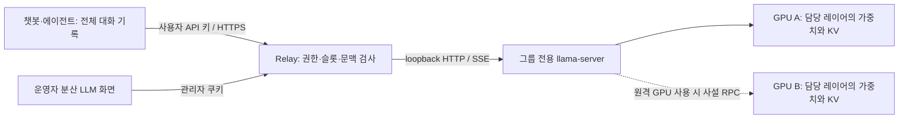

# 분산 LLM 실행과 KV 관리: 구현·운영 기록

2026-09-27 추가: 두 GPU의 시작 전 용량 배치, 요청 단계별 `lastAttempt` 계측, 선택적 `--batch-size`/`--ubatch-size`, Windows CUDA 실험 커널과 검증 범위는 [커널 개발 기록](kernel-development-ko.md)을 참조한다. 실험 커널은 현재 llama.cpp 실행 경로에 연결되지 않았다.

2026-09-24 갱신. [Petals 비교 결정](petals-architecture-decision-ko.md)에 따라 EC2·llama.cpp를 유지하고 단일 실행 그룹 기본·선택 예비·가용 그룹 배정을 적용했다. [선행연구·비교 보고서](kv-cache-scheduling-research-ko.md)와 [Ponytail full 스킬](https://github.com/DietrichGebert/ponytail/blob/main/skills/ponytail/SKILL.md)의 기존 실행기 재사용 원칙을 유지한다. 새 패키지 의존성은 없다.

## 구현한 범위

한 GGUF 모델을 **고정된 GPU 그룹에서 실행**하고 필요하면 여러 GPU에 연속 레이어로 분할하는 경로다. 한 호스트에서는 RPC 없이 실행할 수 있다. 이전 문서 추출 worker는 각 PC에 모델 전체가 들어가는 별도 실행 경로로 유지된다. 웹의 **분산 LLM** 메뉴에서 실행 그룹 하나와 선택적 예비를 독점 예약하는 전용 공간을 만들고 `/v1/workspaces/<id>/chat/completions`로 호출한다. 일반 `/v1/chat/completions`는 같은 모델의 미예약·제공 가능·빈 슬롯 그룹 중 세션 KV, 엔진 준비 상태, 빈/만료 캐시 슬롯 존재, 낮은 슬롯 점유율 순으로 배정한다. [네 계층 구현 계약](distributed-workspace-design-ko.md)에 책임을, [라우팅·KV 검토](reports/routing-kv-review-ko.md)에 코드 근거와 캐시 보존 절차를 정리했다.

지금 버전은 운영자가 승인한 GPU들로 구성한 관리형 파일럿이다. LAN과 WAN의 인증된 사설 overlay를 모두 설정할 수 있다. 등록된 그룹의 비용·실측/추정 선언을 제시하며 예비를 선택한 공간만 장애 시 그 그룹으로 교체한다. 임의 GPU 탐색·모델 배포·가격 협상·시간제 자동 과금은 구현하지 않았다. 공개된 불특정 GPU 제공자를 신뢰 없이 사용하게 만드는 시스템은 아니다. llama.cpp RPC는 인증과 암호화를 제공하는 인터넷 공개 서비스가 아니며, 제공자는 모델과 처리 중인 데이터에 접근할 수 있다. [공식 RPC 문서](https://github.com/ggml-org/llama.cpp/blob/b10964/tools/rpc/README.md)



KV 자체를 중앙 DB나 문서 작업 JSON으로 옮기지 않는다. 같은 토큰 순서의 각 레이어 KV를 해당 레이어의 GPU에서 엔진이 관리한다. 요청은 모델 전체 그룹의 한 슬롯을 얻는다. 개별 문서 작업을 여러 GPU에 보내고 결과를 합치는 방식으로 VRAM을 합쳤다고 간주하지 않는다.

## 결정과 trade-off

| 결정 | 선택 이유 | 비용·현재 한계 / 다음 단계 조건 |
|---|---|---|
| llama.cpp layer split 재사용 | 기존 GGUF·런타임 자산과 호환, KV·activation 구현 중복 제거 | RPC는 실험적이며 신뢰된 네트워크 필요. 불신 제공자 지원은 실행 검증·격리·별도 프로토콜이 선행되어야 함 |
| 고정 GPU 그룹 + 실행 하나·선택 예비 독점 | 물리 GPU 중복과 공간 간 슬롯 혼합을 차단, 불필요한 예비 예약 제거 | 예비 없으면 자동 우회 없음. 예비는 사전 적재한 한 그룹이며 부분 장치 대체·자동 보충은 없음 |
| 모든 슬롯의 최대 문맥을 사전 예약 | 출력 중 KV가 자라 OOM 나는 경로를 줄이고 각 GPU 병목을 검사 | 짧은 대화에서는 VRAM 여유를 활용하지 못함. 가동률 측정 후 vLLM/PagedAttention 기반 별도 그룹 검토 |
| tenant+session별 슬롯 친화성 | 같은 대화의 prefix KV 재사용, 임차자 간 캐시 혼합 방지 | 슬롯 선점·5분 경과·재시작 시 전체 prompt 재계산 |
| 엔진 RAM prompt cache 비활성 | 슬롯 밖의 cross-tenant prefix 저장·복원 경로 제거 | 서로 같은 프롬프트라도 임차자 간 공유 이득 없음 |
| 전체 대화 기록 재전송 | KV 유실 후 재계산 가능, 중앙의 별도 대화 저장소 불필요 | 긴 대화의 HTTP 전송과 cold prefill 비용. 기본 HTTP 본문 90,000바이트 제한 |
| 사용자별 동시 실행 상한 + 가득 차면 429 | 무제한 대기열·head-of-line 지연 없이 제한된 부하에서 동작 | 토큰 비용 기준 공정성 보장은 아님. 실측 수요에서 지속 기아 발생 시 tenant 공정 큐/VTC 추가 |
| 예비를 선택한 공간만 한 번 재생성 | 같은 모델·설정·전체 기록으로 장애 복구 | 기본 SSE는 완료 후 전달. 즉시 스트리밍은 폐기/재시작/완료 이벤트를 처리하고 도구는 완료 후 실행 |
| 선택적 process-local 재시도 영수증 | HTTP 재전송이 새 추론을 만드는 것을 억제 | 서버 재시작 뒤 정확히 한 번 실행은 보장하지 않음. 유료 정산 도입 전 영속 원장과 연결 필요 |

WAN에는 연산량이 작은 decode에서도 왕복 지연이 반복되고 첫 모델 전송·prefill 비용이 발생한다. `topology: "wan"`은 배치 의도를 기록하며 성능을 자동 보장하거나 네트워크 측정을 대신하지 않는다. 그룹 수와 경계를 늘리기 전에 실제 TTFT·tokens/s·부하별 p95를 측정한다. TP, P/D 분리, KV 이주는 현재 엔진 위에 흉내 내어 추가하지 않았다.

## 용량 계약

[설정 예제](examples/inference.config.json)를 복사하고 모든 해시·GPU ID·메모리 수치를 실제 값으로 바꾼다. 예제는 실측 배치가 아니다. 동일 모델의 실행·예비 두 그룹(8082/8083)을 포함하며 각각 `hourlyCost:2`, `currency:"CR"`는 예시 비용이다. 양자화·엔진 버전과 실제 가격을 함께 확인한다. 성능을 측정하지 않았다면 `performance`를 넣지 않는다. `vramMiB`는 OS·다른 작업의 점유를 제외해 이 서비스에 허용한 한도다. `weightsMiB`는 출력 가중치 등 담당 장치의 전체 가중치, `workspaceMiB`는 실제 배치 크기에서 측정한 연산 버퍼, `reserveMiB`는 별도 안전 여유다.

현재 계산기는 **모든 레이어가 동일한 full-attention MHA/GQA이고 K/V head dimension이 같은 모델의 f16 KV**를 지원한다. 실행기는 실제 GGUF의 아키텍처·레이어·KV head·K/V 차원·학습 문맥을 검사하며 dense `llama`, `qwen2`, `qwen3`로 지원 범위를 제한한다. MLA, recurrent/hybrid, sliding-window 혼합, 비대칭 K/V, MoE, NextN/MTP, 공유 KV 등 지원하지 않는 메타데이터는 시작 전에 거부한다. 새로운 아키텍처는 별도 메모리 모델과 실행 검증 후 추가한다.

각 GPU의 예약은 다음과 같다.

```text
KV bytes/token = 2(K,V) × 담당 transformer layers × KV heads × head dimension × 2(f16)
KV MiB = KV bytes/token × contextTokens × slots / 1048576
requiredMiB = weightsMiB + workspaceMiB + reserveMiB + KV MiB
requiredMiB <= vramMiB 를 모든 GPU에서 만족해야 함
```

예제의 64층/8 KV heads/128 head dimension 모델은 8K 문맥·슬롯 1개에서 그룹당 KV 2GiB, 반복 레이어 32개씩인 GPU당 1GiB다. 적재한 각 그룹이 이 용량을 사용하되 공간은 선택한 그룹만 독점 예약한다. 슬롯을 2개로 늘리면 그룹당 KV 4GiB이며 `--ctx-size`는 16384, `/props` 슬롯별 실효 문맥은 8192다. 공간은 그룹 슬롯 수와 별개로 활성 요청을 하나로 제한한다.

**실행기 분할 비율은 레이어 수에서 도출한다.** b10964는 `--gpu-layers all` 배치에서 출력 레이어를 추가한다. 32/32 반복 레이어 구성은 단순 `1,1`이 아니라 `32,33` 비율로 실행한다. 마지막 GPU의 출력 가중치도 그 장치의 `weightsMiB`에 포함해야 한다. [b10964 실제 배치 코드](https://github.com/ggml-org/llama.cpp/blob/b10964/src/llama-model.cpp)

설정 검사는 선언을 검증한다. `/props`는 GPU별 물리 메모리 사용을 증명하지 않는다. 프로세스 시작 시 출력되는 장치 순서·레이어/KV/compute buffer 크기와 최대 문맥 부하에서의 VRAM을 확인해야 한다. GPU의 전역 ID는 실제 GPU UUID를 포함해 일관되게 정하고, 동일 GPU를 기존 문서 worker·다른 Relay 인스턴스·별도 프로세스에 중복 제공하지 않는다. 현재 한 그룹은 **전용 엔진 1개, Relay 프로세스 1개**만 사용한다.

## 준비와 실행

아래는 원격 GPU를 포함한 PowerShell 예시다. 경로·IP·장치명은 실제 장비에 맞게 바꾼다. 실제 GPU 실행은 명령을 실행하는 운영자의 명시적 작업이며 웹 접속이나 파일 탐색으로 자동 시작하지 않는다.

**한 호스트에서 실행할 때:** 그룹의 `gpus`에 로컬 GPU만 선언하고 같은 장치 순서를 사용한다. RPC worker·사설 peer 준비는 건너뛰고 장치 목록은 `llama-server.exe --list-devices`로 확인한다. 7번의 `server` 명령에서 `--rpc 192.168.10.22:50052`와 `--trusted-private-network`를 생략하고 `--device`를 실제 로컬 장치 목록(한 GPU이면 `CUDA0`)으로 바꾼다. 모델·템플릿·메모리 예산·키 검사는 동일하다.

1. 각 제공자 PC에 동일한 b10964 소스 계열의 RPC 지원 빌드를 준비한다. `ggml-rpc-server`와 leader의 `llama-server` 모두 해당 GPU backend와 RPC를 지원해야 한다. 공개 prebuilt 파일이라고 RPC가 반드시 활성화된 것은 아니다. 공식 RPC 문서의 `GGML_RPC=ON` 빌드 설정을 확인한다. 런타임과 로컬 DLL은 신뢰하는 배포본을 사용한다. 실행기에서 검증하는 SHA-256은 지정 실행파일의 해시이며 종속 DLL 전체의 원격 증명은 아니다.
2. 격리된 LAN 또는 상호 인증·암호화된 overlay를 준비한다. RPC 포트는 leader에서만 접근하도록 방화벽으로 제한한다. 실행기는 RFC1918과 `100.64.0.0/10` IPv4만 허용하며 공인 IP·호스트명·`0.0.0.0`을 거부한다. 사설 IP라는 사실만으로 네트워크 인증이 되지는 않는다.
3. 파일 해시를 계산하고 예제 설정의 값을 바꾼다. 모델은 현재 단일 GGUF 파일이어야 한다. 여러 GGUF shard는 전 파일 해시 계약을 추가하기 전까지 거부한다.

```powershell
(Get-FileHash C:\models\model.gguf -Algorithm SHA256).Hash.ToLower()
(Get-FileHash C:\models\chat-template.jinja -Algorithm SHA256).Hash.ToLower()
(Get-FileHash C:\llama\llama-server.exe -Algorithm SHA256).Hash.ToLower()
(Get-FileHash C:\llama\ggml-rpc-server.exe -Algorithm SHA256).Hash.ToLower()
```

4. 제공자 PC에서 RPC worker를 시작한다. `--device CUDA0`은 해당 PC의 장치명이다. 아래는 상태 알림·중단 GUI를 포함한다. 먼저 별도 제공 키를 발급하고 해당 키의 SHA-256을 중앙 설정의 `groups[].gpus[].providerKeySha256`에 넣는다. 임차자·관리자·일반 worker 노드 키를 재사용하지 않는다. 환경변수의 자리표시 값은 발급한 32~256자 ASCII 키로 바꾼다.

```powershell
$env:RELAY_INFERENCE_PROVIDER_TOKEN = 'REPLACE_WITH_THIS_PC_PROVIDER_KEY'
python provider/distributed_runtime.py rpc --binary C:\llama\ggml-rpc-server.exe --binary-sha256 RPC_EXECUTABLE_SHA256 --bind 192.168.10.22 --port 50052 --device CUDA0 --trusted-private-network --coordinator https://relay.example.com --group qwen32-lan --gpu-id host-b/GPU-REPLACE-B --gui
```

5. leader에서 실제 장치 목록을 확인한다. RPC 장치 이름은 `RPC0`, `RPC1` 등이며 peer 순서·각 PC에서 공개한 장치 수에 따라 달라진다. `groups[].gpus` 순서와 `--device` 순서를 같게 맞춘다.

```powershell
C:\llama\llama-server.exe --rpc 192.168.10.22:50052 --list-devices
```

6. 중앙 서버와 leader가 공유할 설정을 준비한다. leader와 Relay를 같은 호스트에서 실행하는 구성이 가장 단순하다. 설정에는 사용자·GPU 제공자 키 **해시**만 저장한다. 다음 명령은 새 키와 그 해시를 로컬 터미널에 출력한다. 키는 해당 사용자에게만 전달하고 `keySha256`에는 해시만 넣는다.

```powershell
python -c "import secrets,hashlib; key=secrets.token_hex(32); print('API key:',key); print('keySha256:',hashlib.sha256(key.encode()).hexdigest())"
$env:RELAY_INFERENCE_CONFIG = 'C:\gpu_togeter\inference.local.json'
node --input-type=module -e "import fs from 'node:fs'; import {planInferenceConfig} from './lib/relay/inference-plan.mjs'; const c=JSON.parse(fs.readFileSync(process.env.RELAY_INFERENCE_CONFIG,'utf8').replace(/^\uFEFF/,'')); console.log(JSON.stringify(planInferenceConfig(c),null,2));"
```

키를 소스 저장소에 추가하지 않는다. 원격 임차자 API를 제공할 때는 README의 TLS reverse proxy 설정과 `RELAY_PUBLIC_ORIGIN=https://...`, `RELAY_SECURE_COOKIE=1`을 적용한다. reverse proxy의 요청/응답 timeout은 긴 추론을 허용하도록 설정하고 SSE buffering을 끈다.

7. leader에서 모델을 시작한다. 모델 해시·템플릿 해시·alias·슬롯 수·문맥·포트는 같은 설정 파일의 선택 그룹에서 읽는다. 실행파일·모델·템플릿의 로컬 경로는 CLI에서 명시적으로 지정하며 연결 파일에서 임의 프로그램을 실행하지 않는다.

```powershell
$env:RELAY_INFERENCE_PROVIDER_TOKEN = 'REPLACE_WITH_THIS_PC_PROVIDER_KEY'
python provider/distributed_runtime.py server --group-config C:\gpu_togeter\inference.local.json --group qwen32-lan --binary C:\llama\llama-server.exe --binary-sha256 SERVER_EXECUTABLE_SHA256 --model C:\models\model.gguf --template C:\models\chat-template.jinja --rpc 192.168.10.22:50052 --device CUDA0,RPC0 --trusted-private-network --metrics --coordinator https://relay.example.com --gpu-id host-a/GPU-REPLACE-A --gui
```

각 `--gpu-id`는 그 PC가 실제로 소유한 로컬 장치만 지정하며 여러 로컬 GPU이면 반복한다. leader의 원격 `RPC0` 장치는 그 PC의 알림 목록에 넣지 않는다. 같은 PC의 여러 장치를 한 키로 보고하려면 해당 GPU 항목들에 그 키의 해시를 지정한다. `--coordinator` 없이 기존 실행도 가능하지만 중앙에 명시적인 제공·회수 알림은 보내지 않는다.

예비가 필요하면 `qwen32-standby`도 별도 장치로 같은 절차를 반복해 적재한다. 두 그룹의 모델·템플릿 해시·양자화·엔진 버전·문맥·아키텍처는 같아야 하며 GPU ID·endpoint는 달라야 한다. 한 그룹만 준비해도 해당 그룹 ID의 단일 후보로 공간을 만들 수 있다. 예비를 선택하지 않았다고 이미 실행 중인 예비 프로세스가 자동 종료되지는 않는다.

세부 레이어 배치는 `--verbose`를 추가해 확인할 수 있다. 이 디버그 로그에는 프롬프트가 포함될 수 있으므로 검증용 공개 데이터로만 확인하고 공유 전에 검토한다.

실행기는 연속 배칭이 가능한 고정 슬롯, f16 KV, 전체 GPU offload, 자동 fit·context shift·공유 RAM prompt cache 비활성화를 설정한다. 슬롯 삭제 API에 필요한 `--slot-save-path`는 전용 임시 디렉토리를 사용하며 정상 정리 시 회수한다. Relay는 save/restore API를 호출하지 않는다. 이 flag가 없으면 b10964의 erase도 사용할 수 없다. [서버 구현](https://github.com/ggml-org/llama.cpp/blob/b10964/tools/server/server-context.cpp)

8. 별도 터미널에서 같은 `RELAY_INFERENCE_CONFIG`를 지정하고 `npm run build`, `npm start`를 실행한다. 브라우저에서 로그인하고 **분산 LLM**의 단일 실행 그룹 또는 예비 포함 후보를 선택해 공간을 만든다. 선택한 그룹의 health·모델 alias·템플릿·슬롯·문맥·idle 상태와 KV 초기화를 모두 확인해야 공간이 준비된다. 생성 때 한 번 반환되는 공간 키를 연결 설정 JSON으로 저장한다. 일반 그룹의 `연결 미확인`은 구성만 읽었다는 뜻이다. EC2는 기존 배포 절차를 따르며 이 명령이나 소스 변경으로 운영 서버가 자동 갱신되지 않는다.

WAN은 위 peer IP를 overlay IP로 바꾸고 그룹 `topology`를 `wan`으로 설정한다. raw RPC 인터넷 port forwarding은 지원 절차가 아니다. 원격 leader를 사용할 경우 Relay의 upstream은 여전히 loopback이어야 하므로 인증된 로컬 터널이 필요하다. 그 경우 공유 manifest의 loopback 포트와 터널 도착 포트를 일관되게 운영해야 한다.

## 제공자 회수와 실행 공간 복구

제공자 GUI의 중단 버튼이나 Ctrl+C는 자신이 시작한 native 프로세스를 종료한다. `providing → reclaiming → released` 중 반환 완료는 프로세스 종료를 확인한 뒤에만 표시한다. 상태 알림은 별도 스레드에서 `/api/inference/provider`로 전송하므로 중앙 서버·네트워크·예비 복구가 로컬 회수를 붙잡지 않는다. GPU별 `runtimeId`, `startedAt`, 상태·승인 키 해시는 SQLite `relay_inference_providers`에 보존해 중앙 재시작 뒤에도 오래된 알림을 구분한다. 알림 원문·snapshot에는 키 해시를 노출하지 않는다.

예비 없는 공간은 장애 시 요청 실패를 반환하며 다른 그룹으로 자동 우회하지 않는다. 예비를 선택한 공간만 그 그룹에서 같은 전체 기록으로 한 번 재생성한다. 예비 전환 후 상태는 `degraded`이고 예비를 자동 보충하지 않는다. 다른 모델·양자화·엔진·비용 조건으로 바꾸지 않는다. `recoveryTimeoutMs`는 감지부터 대체 엔진 첫 출력까지 기본·최대 60초이며 기존 KV 정리 시간도 포함한다. JSON·기본 SSE 요청도 내부 스트림으로 첫 출력을 관찰한다. 전체 요청 제한 `requestTimeoutMs`는 별도이며 첫 출력 이후 정상 답변을 60초에 자르지 않는다. 이 목표를 실장비에서 달성했다는 뜻은 아니다.

공간 종료 API는 요청/KV 정리 뒤 그룹 예약을 해제한다. 제공자의 모델 적재 프로세스를 원격 종료하지 않는다. 실제 GPU 반환과 다음 공간을 위한 예약 해제를 구분한다.

## API와 세션

- `GET /api/inference`: 관리자 쿠키로 그룹 계획·관측 상태·사용량을 조회. 사용자 키 해시·backend URL·대화 원문은 반환하지 않는다.
- `POST /api/inference/chat`: 관리자 화면용 추론. 관리자 계정은 별도 `operator` namespace다.
- `GET/POST /api/inference/workspaces`, `DELETE /api/inference/workspaces/<id>`: 관리자 쿠키로 자기 공간 후보·목록·생성·종료. 관리자 추론은 `POST /api/inference/workspaces/<id>/chat`.
- `GET/POST /v1/workspaces`, `DELETE /v1/workspaces/<id>`: Bearer 임차자 키로 자기 공간 관리. 생성 본문은 `{"candidateId":"조회한 후보 ID","name":"공간 이름"}`.
- `POST /v1/workspaces/<id>/chat/completions`: 소유 임차자 키 또는 생성 시 한 번 반환하는 `accessKey`로 고정 주소 추론. 공간 키는 목록·생성·종료 권한이 없으며 서버는 해시만 저장한다.
- `GET /v1/models`: Bearer 임차자 키로 허용 모델 목록 조회.
- `POST /v1/chat/completions`: Bearer 임차자 키로 공간에 예약되지 않은 그룹의 텍스트 chat completion. `stream:true` SSE, 함수 도구 정의·도구 응답 기록을 지원하지만 Relay가 도구를 실행하지는 않는다.

```python
import json, os, urllib.request
body = {
    "model": "qwen3-32b",
    "session_id": "conversation-001",
    "messages": [{"role": "user", "content": "KV 캐시의 역할을 설명해 줘."}],
    "max_tokens": 512,
    "stream": False,
}
request = urllib.request.Request(
    "http://127.0.0.1:8788/v1/workspaces/" + os.environ["RELAY_WORKSPACE_ID"] + "/chat/completions",
    data=json.dumps(body).encode(),
    headers={"Content-Type": "application/json", "Authorization": "Bearer " + os.environ["RELAY_INFERENCE_KEY"],
             "Idempotency-Key": "conversation-001-turn-0001"},
)
with urllib.request.urlopen(request, timeout=620) as response:
    print(json.load(response)["choices"][0]["message"])
```

위 예제의 `RELAY_WORKSPACE_ID`와 `RELAY_INFERENCE_KEY`에는 생성한 공간 ID와 공간 키(또는 소유 임차자 키)를 설정한다. SQLite `relay_workspaces`는 공간 ID·고정 주소·소유자·선택 fingerprint·키 해시만 포함하는 관리 상태를 보존하며 대화·진행 요청·KV·추론 영수증을 저장하지 않는다. 재시작 시 소유권·선택 계약이 바뀐 공간은 자동 교체하지 않고 새 생성을 요구한다.

후속 턴에는 직전 assistant 응답과 새 user 메시지를 포함한 **전체 기록**을 보낸다. `session_id`는 캐시 친화성을 위한 식별자이며 서버에 저장된 대화의 조회 키가 아니다. tenant·model·workspace·session을 함께 식별하므로 다른 사용자나 모델이 같은 session_id를 써도 충돌하지 않는다. 같은 소유자의 동시 요청은 409다. 5분 이상 유휴하거나 슬롯이 다른 세션으로 배정되면 KV를 재사용하지 않고 재계산한다. 세션 ID 없는 완료 요청은 캐시 소유자를 남기지 않으며 물리 VRAM 반환을 뜻하지 않는다.

`max_tokens`는 출력 전체의 상한이며 기본 1024, 1~32768을 허용한다. 실제 tokenizer의 입력 수 + 출력 예약이 슬롯 문맥을 넘으면 **422**, 슬롯/사용자 동시 한도는 **429**, 설정·엔진·연결 오류는 **503**이다. 기록을 몰래 잘라 넣거나 KV를 다른 모델에 붙이지 않는다. 멀티모달 URL/파일, raw prompt, 임의 `id_slot`, `n_predict`, LoRA 변경, 모델/URL override는 허용하지 않는다.

준비된 그룹에서 요청별 KV 삭제 전에 입력 토큰을 검사한다. 입력 오류·문맥 초과·토큰 검사 중 취소는 이전 KV와 캐시 시각을 보존한다. 실제 생성 호출 직전부터 실패 정리가 필요하며, 이미 시작한 erase는 ACK를 기다린다. 같은 그룹의 동시 계약 검사는 공유하되 과거 epoch의 실패로 새 실행을 중단하지 않는다.

`Idempotency-Key`는 비스트리밍에서만 선택적으로 지원한다. 같은 사용자·같은 키·같은 요청은 실행 중 409, 완료 후 저장 응답을 재사용한다. 같은 키의 다른 내용은 409다. 실행 결과가 불확실하면 같은 키로 새 추론을 시작하지 않는다. 기록은 완료 후 10분, 사용자당 256개·전체 4096개까지이며 응답 본문 합계는 8MiB다. 본문 한도를 넘은 결과는 재전송 대신 409를 반환하는 fence만 남긴다. 서버 재시작 시 이 기록은 사라진다.

공간 SSE 기본값은 완료·`[DONE]`·스트림 종료를 검증한 한 시도만 전달한다. 즉시 조각을 받으려면 `stream:true, restart_on_failure:true`를 지정하고 `relay.restarting`의 `discard:true`에서 이전 텍스트·추론·도구 호출을 폐기한다. 이 모드의 확정 신호는 `relay.completed`이며 `[DONE]`만 보고 도구를 실행하면 안 된다. 기본 방식은 화면 첫 출력이 늦지만 복구 시간은 내부 엔진의 첫 출력으로 따로 측정한다.

일반 그룹 SSE도 정상 `[DONE]`·스트림 완료 전 출력은 미완료다. 중간 출력이나 미완료 도구 호출을 완료된 대화 기록으로 확정하지 않는다. Relay는 소비가 느리거나 읽기가 멈춘 경우에도 timeout/취소를 처리하고 엔진의 erase 확인 전 슬롯을 돌려주지 않는다. 한 요청의 중지·옵션 오류는 다른 사용자의 실행을 중단하지 않는다. 삭제 확인이 실패하면 그룹을 `unavailable`로 격리하고, 다음 요청에서 모든 엔진 슬롯이 idle인지 확인 후 지우고 회복한다. GPU 손실 시 live KV를 복구하거나 출력 중간에서 이어 생성하지 않는다.

## 검증과 남은 실측

공간 검증은 `tests/inference-workspaces.test.mjs`의 예약·재생성·취소·키·복원, `tests/workspace-http.test.mjs`의 HTTP 권한·SQLite 재시작, `tests/inference-browser.test.mjs`의 실제 화면 생성·추론·복구·종료 흐름을 포함한다.

```powershell
npm test
python -m unittest discover -s tests -p "*_test.py" -v
npm run test:browser
npm run check
npm run lint
npm run build
```

자동 테스트는 GPU별 용량·동일 모델 계약·가격/성능 선언, 공간 소유권·키 범위·저장 복원·단일 요청, 실행/예비 예약·한 번 재생성·SSE 폐기/완료, 제공 세대·로컬 회수, 기존 토큰·KV·취소·HTTP·프로세스 계약을 검사한다. HTTP 테스트의 엔진은 **가짜 backend**이며 성능 측정이 아니다.

이번 환경에는 NVIDIA RTX 3050 Ti 4GiB 한 대만 확인됐다. 두 번째 GPU 및 사설망 peer가 제공되지 않아 다중 GPU 실제 모델 실행, LAN/WAN 성능, 제공자 이탈 후 물리 VRAM 반환을 검증했다고 주장하지 않는다. 이전 README의 단일 GPU 추출 성공 기록도 새 분산 경로의 성능 증거가 아니다.

실장비 배포 승인 전에는 같은 실제 모델/문맥으로 단일 사용자 및 2/4개 동시 요청의 GPU별 peak VRAM, TTFT, decode tokens/s, p50/p95, 모델 cold-load 시간, WAN RTT/대역폭, RPC 강제 종료 뒤 오류/정리 시간을 기록한다. 그 결과로 workspace와 reserve를 보정한 뒤 slots를 늘린다. 이 자료 없이 더 복잡한 동적 scheduler가 더 효율적이라고 결론 내리지 않는다.

### 이전 검증 기록 — 2026-09-18

아래 숫자는 당시 기록이며 현재 네 계층 구현의 전체 테스트 수가 아니다. 이번 구현은 위 명령으로 다시 검증한다.

- `npm test`: Node 91개 통과.
- 전체 Python unittest: 114개 통과. 공통 GGUF 파서 변경 후 기존 GUI·모델 탐색 회귀 포함.
- TypeScript·ESLint·Vite production build 통과.
- 설치된 Edge의 headless 브라우저에서 synthetic engine으로 두 턴의 전체 기록 전달, 문맥 초과 후 입력 보존, 중지·화면 이동 시 슬롯 정리, 모바일 가로 넘침을 확인했다. 가로 스크롤 표에 키보드 접근을 추가했고 브라우저 JavaScript 오류와 axe 접근성 위반은 0건이었다.
- 이 결과는 제어 경로의 검증이며 실제 다중 GPU 추론 성능을 나타내지 않는다.
