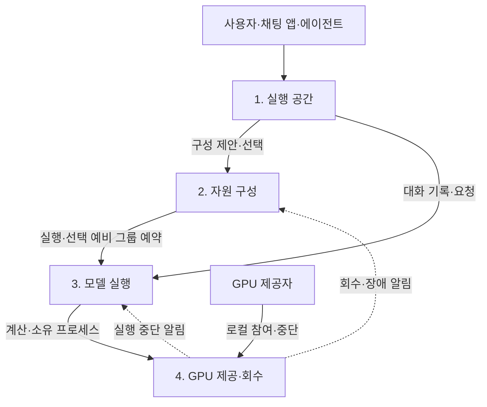

# 분산 LLM 실행 공간 — 네 계층 설계와 구현 계약

2026-09-24. [Petals 비교 결정](petals-architecture-decision-ko.md)에 따라 EC2·기존 실행기를 유지하고 단일 실행 그룹을 기본으로 한다. [전체 아키텍처](architecture-review-ko.md)의 분산 GPU 관리 절과 함께 현재 책임·API·복구 계약을 설명한다. 실행 명령은 [분산 운영 기록](distributed-inference-ko.md)을 참조한다. 실제 다중 GPU·WAN 성능이나 1분 이내 복구를 달성했다는 검증 기록은 아니다.

Ponytail 원칙에 따라 Node gateway·SQLite·Python 실행기·llama.cpp를 재사용한다. 네 계층을 별도 서버로 나누거나 새 스케줄러·KV 전송 프로토콜을 만들지 않았다.

## 사용자가 받는 것

**추론은 참여 PC의 GPU에서 로컬 모델을 직접 실행하는 방식으로 제공한다. 외부 유료 LLM API를 사용하지 않으며, 장애·용량 부족·복구 실패 시에도 유료 LLM API로 우회하지 않는다.** 여기서 로컬 실행은 한 사용자의 PC 한 대에 한정되지 않고, 참여 PC들의 로컬 실행기가 모델을 나눠 실행한다는 뜻이다. 사용자에게 제공하는 API 주소는 이 분산 실행 공간의 접속 인터페이스다. GPU 임대·중앙 서버·네트워크 운영 비용은 외부 LLM API 사용료와 별개다.

사용자는 허용된 모델의 실행 GPU 구성과 선택적 예비를 골라 **전용 실행 공간**을 만든다. 채팅 앱·에이전트는 `/v1/workspaces/<id>/chat/completions`라는 고정 주소로 호출한다. 선택할 그룹의 모델 파일·엔진·모델 적재와 필요한 사설 연결은 운영자가 먼저 준비해야 한다. 한 호스트에서는 RPC 없이 실행할 수 있다. 회원 GGUF 업로드를 임의 PC들에 자동 배포하는 기능은 포함되지 않는다.

단일 호스트, LAN과 인증·암호화된 사설 overlay WAN을 같은 API로 이용한다. 공간은 선택한 실행 그룹과 예비가 있으면 그 그룹까지 독점 예약하며 **활성 추론 요청은 한 번에 하나**다. 후속 동시 요청은 대기시키지 않고 409로 거절한다. 여러 대화가 순차적으로 이용할 수 있고 KV 소유자는 인증 임차자와 `session_id`로 구분한다. 제공자는 필요할 때 자신의 GPU 제공을 중단할 수 있다.

## 네 계층과 전달 정보

계층은 책임과 경계이며 네 개의 서버나 프레임워크를 뜻하지 않는다.

| 계층 | 받는 것 | 책임 | 내보내는 것 |
|---|---|---|---|
| **1. 실행 공간** | 모델·구성 선택, 전체 대화 기록·요청 | 공간 수명·권한·고정 주소, 단일 요청, 복구·응답 교체 표시 | 공간 ID·주소·상태·응답 |
| **2. 자원 구성** | 모델 실행 조건, 예산, 등록 GPU 계획, 성능 선언 | 실행·선택 예비 후보, 독점 예약·해제, 선택한 예비로 교체 | 비용·성능 조건이 붙은 후보와 선택한 그룹 |
| **3. 모델 실행** | 모델·실행 설정, GPU 그룹, 대화 기록 | 엔진 준비·레이어 분할·연산, 추론·미완료 응답 재생성 | 응답 조각·완료 검증·첫 출력 관측 |
| **4. GPU 제공·회수** | 제공자 로컬 시작·중단, 승인된 실행 설정 | 소유 프로세스 시작·종료와 반환 확인 | 제공·회수·반환 상태와 알림 |

실행 공간은 GPU 주소·레이어 배치를 관리하지 않고 자원 구성은 토큰 계산을 구현하지 않는다. 2계층의 확보·해제는 등록 그룹의 gateway 예약이다. 4계층의 프로세스 시작·중단은 해당 PC 실행기에서 수행한다.

2계층은 제어 경로다. 매 토큰이 1→2→3→4를 차례로 통과하지 않으며 실제 레이어·KV 배치와 장치 간 계산은 3계층 엔진이 관리한다.

## 구성 선택과 성능 조건

`planWorkspaceCandidates`는 등록된 실행 그룹 하나를 기본 후보로 제공한다. 이 후보의 `id`는 그룹 ID이고 `standbyGroupId:null`, `groupIds:[id]`다. 기존 `primary~standby` 후보를 선택하면 실행 1개와 예비 1개를 묶는다. 같은 모델 alias의 그룹은 정확한 GGUF·템플릿 SHA-256, `quantization`, `engineVersion`, 문맥 길이와 모델 아키텍처가 같아야 한다. 장치·레이어 분배와 LAN/WAN 구성은 달라도 된다. 물리 GPU ID와 endpoint는 전체 구성에서 중복할 수 없다.

그룹별 `hourlyCost`와 `currency`를 선언하며 선택한 그룹의 비용만 합산한다. 통화 기본값은 `CR`이며 예비를 선택하면 두 그룹의 통화가 같아야 한다. 선택한 그룹의 가격이 없으면 총비용은 `null`, 후보는 선택 불가다. 예제의 각 2 CR/시간은 단일 그룹 2 CR/시간, 예비 포함 4 CR/시간이라는 설정 예시다. **분산 공간의 시간제 자동 과금·임대 원장은 구현하지 않았다.** 예비 미선택은 추가 독점 예약을 줄이며 이미 적재한 예비 프로세스의 물리 VRAM을 자동 반환하지 않는다.

성능은 운영자가 `performance`에 선언한다. `source`는 `measured` 또는 `estimated`이고, `firstTokenMs`, `tokensPerSecond`, `completionRate`, `conditions.inputTokens/outputTokens`를 기록한다. 실측 선언에는 `measuredAt`과 `samples`가 필요하다. 양자화·엔진 버전·문맥·연결 환경은 그룹 계약에서 포함한다. 값이 없으면 미측정이며 중앙 서버가 선언을 자동 벤치마크하거나 인증하지 않는다. 문자열 길이나 SSE 조각 수로 토큰 속도를 계산하지 않는다.

계획 함수의 조건은 `model`, `contextTokens`, `maxHourlyCost`, `minTokensPerSecond`, `maxFirstTokenMs`, `minCompletionRate`다. 성능 조건을 지정하면 선택한 모든 그룹이 실측 선언으로 만족해야 하며 추정·미측정은 통과하지 못한다. 공간 생성 API는 후보 ID와 이름을 받고 선택한 그룹을 고정한다. 선택하지 않은 그룹으로 교체하지 않으므로 비용·모델 조건을 바꾸지 않는다.

**모든 구성에 같은 최소 속도를 강제하지 않는다.** 느리지만 저렴한 구성도 선택할 수 있다. 인터뷰의 ‘첫 응답 3초·초당 20토큰’은 공통 합격선이 아니다. 통계 기준·허용 편차·지속 미달 시 처리는 후속 성능 계약이 필요하며 한 번의 측정이 모든 요청의 고정 속도를 보장하지 않는다. LLM 생성 시간과 에이전트의 외부 도구·API 대기는 구분한다.

## API·수명·저장

| 호출 | 관리자 | 임차자 |
|---|---|---|
| 후보·자기 공간 조회, 공간 생성 | `GET/POST /api/inference/workspaces` | `GET/POST /v1/workspaces` |
| 공간 종료 | `DELETE /api/inference/workspaces/<id>` | `DELETE /v1/workspaces/<id>` |
| 추론 | `POST /api/inference/workspaces/<id>/chat` | `POST /v1/workspaces/<id>/chat/completions` |

관리자는 쿠키와 `operator` 소유권, 임차자는 별도 Bearer 키와 모델 allowlist를 사용한다. 단일 그룹 생성 본문 예시는 `{"candidateId":"qwen32-lan","name":"내 실행 공간"}`이며 후보 ID는 조회 결과에서 고른다. 예비 포함 후보 ID는 `qwen32-lan~qwen32-standby`다. 선택한 모든 그룹의 엔진·슬롯·모델 계약 확인과 KV 초기화가 성공해야 `ready`다.

생성 응답의 `accessKey`는 한 번만 반환하는 공간 전용 키다. 화면에서 연결 설정 JSON을 저장해 외부 앱에 전달한다. 고정 추론 주소는 소유자의 임차자 키 또는 해당 공간 키를 받으므로 관리자 소유 공간도 외부 앱에서 호출할 수 있다. 공간 키로 목록 조회·생성·종료는 할 수 없다. 서버는 해시만 저장하고 이후 snapshot에 키를 노출하지 않는다. 개인 회원 복구 키·일반 provider 노드 키와도 별개다.

SQLite `relay_workspaces`에는 공간 ID·소유자·선택 구성·주소·상태·구성 fingerprint·공간 키 해시를 저장한다. 재시작 뒤 같은 ID와 주소를 복원하고 소유자 권한·현재 구성과 fingerprint를 대조한다. 모델·가격 등 선택 계약이 달라지면 새 공간 생성을 요구한다. **진행 요청·대화 기록·KV·추론 재시도 영수증은 복원하지 않는다.** 클라이언트는 매번 전체 확정 대화 기록을 보낸다.

공간 종료는 새 요청을 막고 진행 요청·준비 정리를 기다린 뒤 KV 삭제를 확인하고 그룹 예약을 푼다. 삭제 확인 실패는 해당 그룹을 격리한다. **공간 종료와 제공자 PC의 native 프로세스 종료는 별개**다. 모델 적재 프로세스는 다음 공간에서도 쓸 수 있으며 실제 GPU 반환은 제공자의 중단 동작으로 수행한다.

## 제공자 중단과 자동 복구

제공자는 `provider/distributed_runtime.py`의 rpc/server 실행에 `--gui`를 추가한 중단 창 또는 CLI의 Ctrl+C로 소유 프로세스를 회수한다. 중앙 통신이나 예비 그룹 준비를 기다리지 않는다.

`--coordinator`, `--group`, 로컬 장치별 `--gpu-id`와 환경변수 `RELAY_INFERENCE_PROVIDER_TOKEN`을 지정하면 `POST /api/inference/provider`로 상태를 알린다. 해당 `groups[].gpus[].providerKeySha256`과 키 해시가 맞아야 한다. 키·키 해시는 상태 화면에 노출하지 않고 모델 실행 자식 프로세스에도 전달하지 않는다. 알림은 별도 스레드에서 최선 노력으로 보낸다.

상태는 `providing → reclaiming → released`다. `released`는 소유 프로세스 종료 확인 후에만 보내며 다른 프로그램의 GPU 점유까지 없다는 측정은 아니다. `runtimeId`·`startedAt`으로 이전 실행기의 늦은 알림이 새 상태를 덮어쓰지 못하게 한다. GPU별 실행 세대·상태·승인 키 해시는 SQLite `relay_inference_providers`에 저장해 중앙 재시작 후에도 구분을 유지하며 조회 응답에는 키 해시를 제외한다.

1. 회수 알림 또는 엔진 실패를 감지한다. 그룹 epoch를 변경해 이전 실행의 늦은 결과를 거절한다.
2. 예비를 선택하지 않았다면 요청 실패를 반환하며 자동 우회하지 않는다. 예비가 있으면 처음 선택해 준비한 그룹으로 전환한다. 자동 재생성은 한 번뿐이며 전환 후 `degraded`로 표시한다. 자동 예비 보충이나 원래 그룹으로의 왕복 재시도는 없다.
3. 같은 대화 기록·현재 입력으로 문맥을 재계산한다. KV를 실시간 복제하거나 이전 생성 위치에서 정확히 이어 쓰지 않는다.
4. 미완료 응답을 폐기하고 새 응답으로 교체한다. Relay는 외부 도구를 실행하지 않으며 미완료 도구 호출도 확정하지 않는다.

예비 포함 공간의 **복구 목표는 장애 감지부터 대체 엔진의 첫 실제 출력까지 1분 이내**다. `recoveryTimeoutMs` 기본값·최댓값은 60,000ms이고 기존 KV 정리 시간도 포함하며 초과하면 요청을 종료한다. JSON 요청도 내부 SSE로 첫 출력을 관찰하므로 전체 답변 생성 시간의 한도가 아니다. 요청 전체 제한 `requestTimeoutMs`는 별도다. `lastRecoveryMs`는 복구 첫 출력 지연이며 제공자 반환 시간과 다르다. 실장비에서 달성했는지는 별도 검증해야 한다.

공간 SSE 기본 방식은 **한 시도의 완료·`[DONE]`·스트림 종료를 검증한 후 그 응답만 전달**한다. `stream:true, restart_on_failure:true`를 지정하면 조각을 즉시 받되 다음 계약을 처리해야 한다.

- `event: relay.restarting`의 `discard:true`를 받으면 이전 부분 텍스트·추론 내용·미완료 도구 호출을 폐기한다. 같은 논리 `requestId`의 `attempt`가 바뀐다.
- `event: relay.completed`를 받아야 응답과 도구 호출을 확정한다. 이 모드에서는 엔진의 `[DONE]`만으로 도구를 실행하면 안 된다.
- 기본 호환 방식은 첫 화면 출력이 전체 생성 뒤로 늦어진다. 내부 엔진 첫 출력으로 기록하는 복구 지표와 구분한다.

## 코드와 남은 범위

| 계층 | 코드 | 구현 책임 |
|---|---|---|
| 실행 공간 | `app/inference-panel.tsx`, `lib/relay/inference.mjs`, `standalone/server.mjs` | 소유권·고정 주소·단일 요청·SQLite 저장·복구 표시 |
| 자원 구성 | `lib/relay/inference-plan.mjs`, gateway 예약 | GPU별 용량·동일 모델 계약·실행/예비 후보·비용과 성능 선언 |
| 모델 실행 | `provider/distributed_runtime.py`, llama.cpp, gateway | 예비 전환·전체 기록 재생성·epoch·완료 검증 |
| GPU 제공·회수 | `provider/distributed_runtime.py`, `/api/inference/provider` | 로컬 중단·소유 프로세스 종료 확인·인증 상태 알림 |

임의 GPU 탐색·모델 배포·동적 그룹 조립, 공간 간 예비 공유, 제공자 작업과 같은 GPU 동시 공유, KV 이주, 영속 추론 영수증·임대 정산은 구현하지 않았다. 예비 소진 후에는 공간을 종료하고 새 구성을 선택한다. 공간당 동시 요청은 409, 사용자·슬롯 상한은 429이며 무제한 대기열을 두지 않는다.

그룹 `ready`는 엔진 계약 확인 상태, 공간 `ready`는 선택한 그룹이 모두 준비된 상태다. 예비 없는 공간도 `ready`가 될 수 있으며 실측 속도 합격이나 장애 복구 보장을 뜻하지 않는다. 일반 추론은 미예약·제공 가능·빈 슬롯 그룹 중 같은 임차자·모델·공간·세션의 5분 이내 KV, `ready → unchecked → unavailable`, 빈/만료 캐시 슬롯 존재, 낮은 슬롯 점유율 순으로 배정한다. 동률이면 최근 배정이 오래된 그룹을 먼저 고른다. 정리 중인 `unavailable` 그룹에 활성 슬롯이 있으면 후보에서 제외한다. 일반 요청 실패를 자동 재전송하지 않으며 다음 요청에서 갱신된 상태로 선택한다. [라우팅·KV 코드 검토](reports/routing-kv-review-ko.md)는 입력 검사 전 캐시 삭제 방지와 동시 준비 검사 공유를 설명한다. `npm test`, `npm run test:python`, `npm run test:browser`, `npm run check`, `npm run lint`, `npm run build`로 재현하며 합성 엔진 테스트와 실제 다중 GPU·WAN·물리 VRAM 반환 검증을 구분한다.
