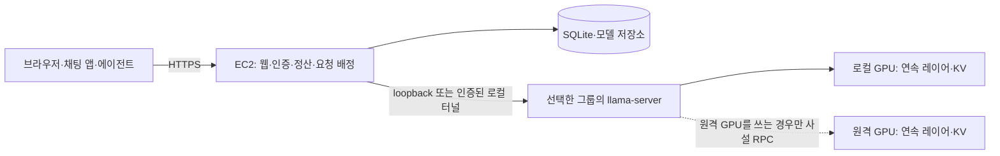

# Petals 비교와 EC2 기반 아키텍처 결정

2026-09-24. **기존 EC2 + llama.cpp/GGUF 구조를 채택한다.** Petals가 현재 서비스보다 빠르다는 동일 조건 실측이 없고, 기존 구조도 연속 레이어 분할과 장치별 KV를 이미 사용한다. 이번 개편은 실행 공간의 필수 예비 예약을 없애고 사용 가능한 그룹으로 요청을 배정한다. Petals 런타임·공개 swarm으로 이전하지 않는다.

## 비교와 선택 근거

| 항목 | 기존 Relay | Petals | 이번 결정 |
|---|---|---|---|
| 모델 실행 | llama.cpp, 업로드 GGUF, Windows 제공자 | PyTorch·지원 Hugging Face 모델, Windows는 WSL 안내 | 기존 모델·제공자 계약 유지 |
| 분할·KV | GPU마다 연속 레이어와 해당 KV, 고정 그룹 | 연속 transformer block과 서버 KV | 같은 기본 원칙 유지, 한 호스트에 들어가면 RPC 생략 |
| 요청 배정 | 기존에는 일반 요청이 첫 모델 그룹에 몰림 | RTT·블록 처리속도·KV 여유로 경로 선택 | 실제 가용 슬롯·세션 KV·준비 상태·점유율로 그룹 선택 |
| 장애 복구 | 실행+예비 전체 그룹 예약, 전체 기록 재생성 | 실패 구간 교체와 activation history 재전송 | 단일 그룹 기본, 전체 예비 그룹은 선택 사항 |
| 중앙 서비스 | EC2 웹·인증·회원·정산·SQLite·HTTPS | DHT·private swarm, CPU bootstrap 가능 | EC2 서비스 유지 |

Petals의 “최대 10배”는 RAM offloading 대비 결과이며 llama.cpp RPC 대비 수치가 아니다. 논문은 장애가 없는 실험에서 cache+restart 기준선이 더 빠르고, 장애율이 높아지면 실패 구간 복원의 이점이 커지는 결과를 제시한다. 따라서 공개 수치만으로 현재 실행기를 교체하지 않는다. [공식 논문 §3.2·§4](https://arxiv.org/html/2312.08361v1)

Petals는 추론 경로에서 RTT·블록 처리시간·KV 잔여량을 고려하고, 실패 서버의 입력 history를 대체 세션에 전달한다. Relay가 채택한 것은 가용 자원과 세션 상태를 보고 배정하는 원칙이다. 동일한 라우팅 알고리즘이나 부분 KV 복구를 구현했다는 뜻은 아니다. [경로 선택 코드](https://github.com/bigscience-workshop/petals/blob/main/src/petals/client/routing/sequence_manager.py), [추론 세션 코드](https://github.com/bigscience-workshop/petals/blob/main/src/petals/client/inference_session.py)

Petals는 Hugging Face 모델용 별도 런타임이며 기존 GGUF 계약을 그대로 대체하지 않는다. CPU bootstrap과 private swarm은 EC2에 배치할 수 있으므로 EC2 유지 자체가 Petals를 배제하는 이유는 아니다. [지원 모델·설치 안내](https://github.com/bigscience-workshop/petals), [의존성](https://github.com/bigscience-workshop/petals/blob/main/setup.cfg), [private swarm 가이드](https://github.com/bigscience-workshop/petals/wiki/Launch-your-own-swarm)

## 적용한 구조

- 공간 기본 후보는 실행 그룹 하나다. 후보 `id=group.id`, `standbyGroupId:null`, `groupIds:[id]`이며 그 그룹의 가격만 표시하고 예약한다.
- 예비를 원하는 경우 기존 `primary~standby` 후보를 선택한다. 두 그룹의 비용을 합산하고 독점 예약하며, 실패 시 같은 전체 기록으로 한 번 재생성한다. 예비 없는 공간은 다른 그룹이나 외부 API로 자동 우회하지 않는다.
- 일반 `/v1/chat/completions`는 같은 모델의 미예약 그룹 중 제공 상태가 사용 가능하고 빈 슬롯이 있는 그룹을 고른다. 5분 안의 같은 임차자·모델·공간·세션 KV, `ready → unchecked → unavailable`, 빈/만료 캐시 슬롯 존재, 낮은 슬롯 점유율 순으로 선택하고 동률이면 최근 배정이 오래된 그룹을 먼저 고른다. `unavailable`이면서 정리 중인 활성 슬롯이 있는 그룹은 제외한다. 사용자 동시 상한과 공간 예약은 그대로 적용한다. 실패한 일반 요청을 다른 그룹에 자동 재전송하지 않으며 다음 요청에서 갱신된 상태로 선택한다.
- 단일 호스트에서는 `server` 실행의 `--rpc`와 `--trusted-private-network`를 생략할 수 있다. 원격 RPC를 사용할 때에는 기존 사설망·인증 overlay·방화벽 조건을 지킨다.

예비를 선택하지 않으면 **그 공간이 추가 그룹을 독점 예약하지 않는 것**이 확정되는 변화다. 예를 들어 각각 2 CR/시간으로 선언된 그룹 두 개 중 하나만 선택하면 표시 비용은 4에서 2 CR/시간이 된다. 이는 설정 예시이며 자동 과금·실제 청구액 절감·tokens/s 향상 실측이 아니다. 기존에 적재해 둔 예비 프로세스는 자동 중지하지 않으므로 전력·물리 VRAM 반환은 제공자가 직접 중지해야 한다.

EC2 배포 파일과 서비스 경계는 변경하지 않는다. 이번 소스 변경은 운영 EC2에 자동 배포되지 않는다. 기본 Compose에 GPU 실행기나 분산 설정을 추가한 것도 아니다.

후속 [라우팅·KV 코드 검토](reports/routing-kv-review-ko.md)에서는 Petals의 실제 구현과 고정 llama.cpp `b10964`의 입력 토큰 처리를 확인해 모델별 세션 구분, 기존 캐시 보존, 동시 준비 검사 공유를 반영했다. 아래 검증 기록은 최초 아키텍처 개편 시점이며 후속 변경의 결과와 구분한다.

## Petals 재검토 조건과 검증 한계

다수의 WAN 제공자가 자주 이탈해 전체 기록 재생성 비용이 커지고, 필요한 모델을 Petals가 지원할 때 private swarm과 현행 실행기를 같은 장비에서 비교한다. 비교에는 다음을 고정하거나 차이를 명시한다.

1. 모델 원본 revision·tokenizer·prompt·입출력 토큰 수·문맥·동시 사용자 수. GGUF와 Petals 양자화가 다르면 품질과 메모리 차이를 함께 기록한다.
2. GPU·VRAM 한도·네트워크 RTT/대역폭·원격 단계 수·cold/warm 상태·요청 반복 횟수.
3. TTFT, decode tokens/s, p50/p95 지연, 완료율, GPU별 peak VRAM, 네트워크 전송량, 장애 후 첫 출력과 전체 완료까지의 시간.
4. 예비 자원·EC2·네트워크를 포함한 비용. 무장애 부하와 동일한 장애 주입 부하를 분리하고 원본 측정 기록을 보존한다.

이번 변경에는 GPU/WAN 대조 벤치마크가 없다. 자동 회귀 검사는 후보·예약·라우팅·세션 격리·취소·복구 계약을 확인하며 실제 GPU 성능 증거가 아니다. Petals와 현재 구현 중 어느 쪽이 더 빠르다는 수치 결론을 내리지 않는다.

## 이번 변경의 검증

2026-09-24: `npm test` 216개 통과, Python unittest 245개 실행 중 1개 건너뛰고 나머지 통과. `npm run lint`, `npm run check`, `npm run build`와 실행 공간 브라우저 회귀도 통과했다. 브라우저에서는 단일 그룹 기본 선택, 예비 포함 복구, 단일 그룹의 `degraded`·가용성 상태 표시를 확인했다.

배포용 `outputs/architecture-20260924/relay-server.zip`을 생성했다(42개 파일, 1,237,229바이트). EC2에 배포하지 않았으며 위 검사와 패키징은 실제 GPU/WAN 성능 측정이 아니다.
